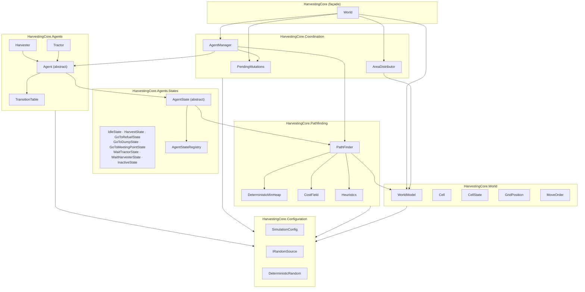
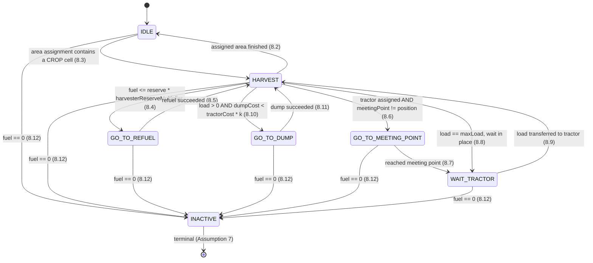
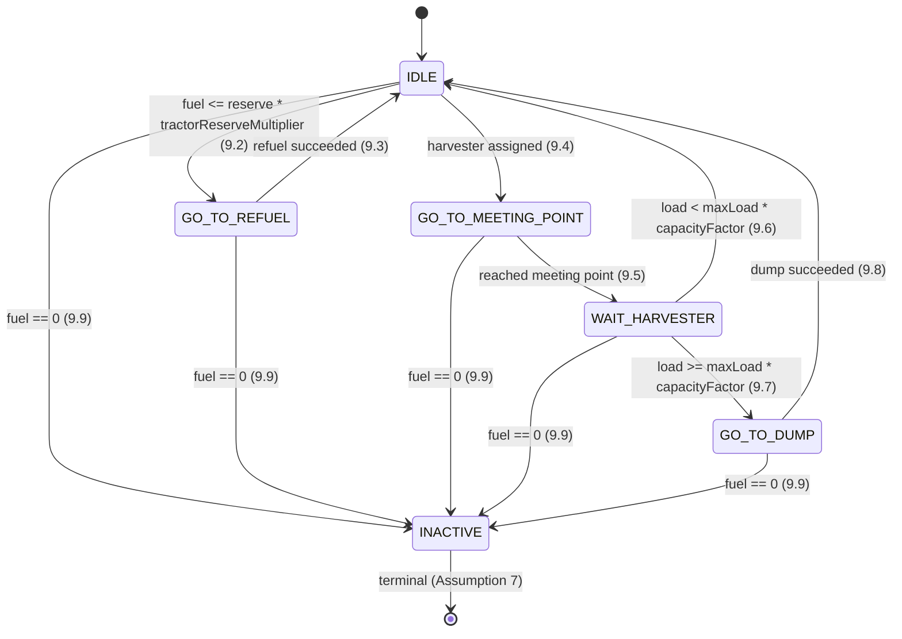
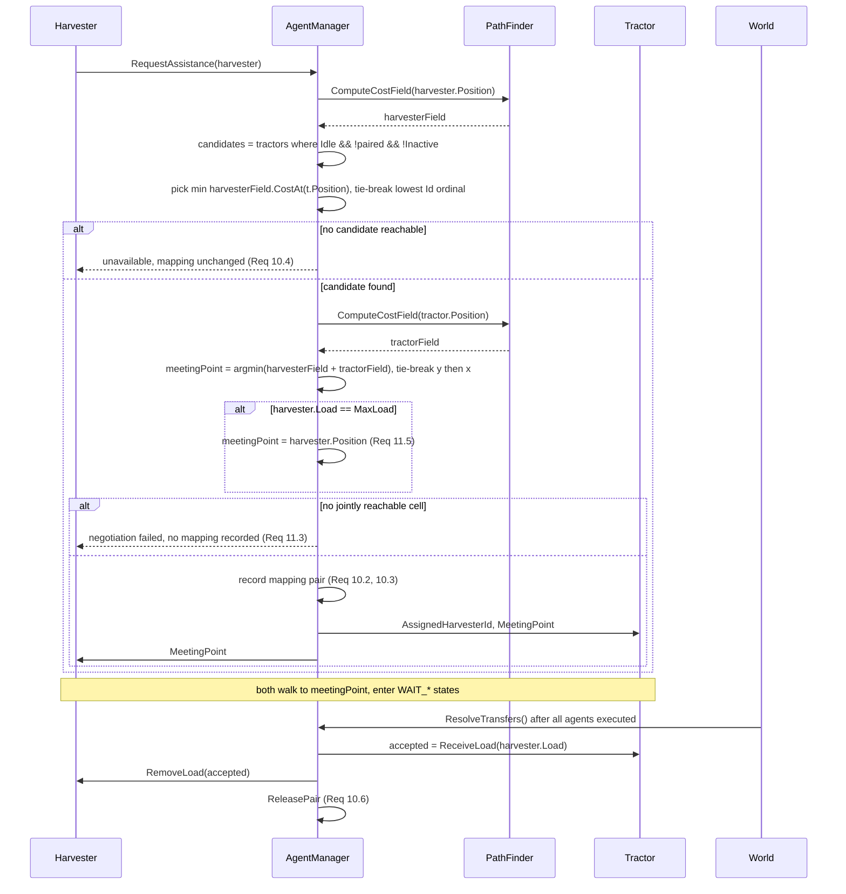
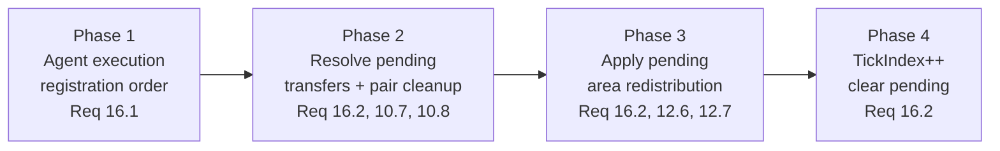

# Design Document

## Overview

`Harvesting_Core` is a deterministic, tick-driven multi-agent simulation core delivered as a plain .NET class library with zero external dependencies, plus a plain console test project that hosts a hand-rolled assertion runner and a hand-rolled property-based testing harness.

The design translates three reference C++ algorithms into idiomatic C#:

| Reference | C# component | Algorithm | Complexity |
| --- | --- | --- | --- |
| `reference/algorithms/area_distribution.cpp` | `AreaDistributor` | multi-source BFS, 8-directional expansion in `Move_Order`, stamps owner ids | `O(n*m)` |
| `reference/algorithms/path_to_best.cpp` | `PathFinder.PathToBestCell` | Dijkstra, terminates at the first expanded cell holding the target state | `O(n*m log(n*m))` |
| `reference/algorithms/path_to_cell.cpp` | `PathFinder.PathToCell` | A* to a specific cell, pluggable heuristic | `O(n*m log(n*m))` worst case |

Three constraints shape every decision below.

**Zero dependencies.** No NuGet, no `UnityEngine`, no xUnit/NUnit/FsCheck. Everything from the priority queue to the PRNG to the property runner is hand-rolled over the BCL.

**Determinism is a feature, not a side effect** (Requirement 18). Every iteration over agents, cells, or frontier entries has an explicit ordering key:

| Iteration | Ordering key | Tie-break |
| --- | --- | --- |
| Agents (tick execution, distribution seeding, pending-queue drain) | registration index | none needed, indices are unique |
| Agent candidate selection (tractor choice) | computed cost | lowest `Id` in ordinal string order (Req 10.5) |
| Cells (scan for minima, generation, serialisation) | flat row-major index `y * width + x` | equals "lowest `y`, then lowest `x`" (Req 11.2) |
| Pathfinding frontier | accumulated cost (`f` for A*) | lowest insertion sequence number (Req 13.7) |
| Neighbour expansion | `Move_Order` index | fixed order, no tie possible |

No `Dictionary` or `HashSet` is ever iterated. Hash containers are used only for `O(1)` keyed lookup; all enumeration walks an ordered `List<T>` or the flat cell array.

**Unity-integration-ready without referencing Unity.** Time is an integer tick index only, `Simulation_Config` is injected, the PRNG is an injected seeded `IRandomSource`, and all observable state is exposed as read-only members. A Unity host later owns only the view: it reads `World.Model.Cells`, `World.Agents`, and calls `World.Tick()` from whatever loop it likes.

### Project and framework layout

```
HarvestingCore.sln
├── src/HarvestingCore/            netstandard2.1 class library  (no dependencies)
```

`netstandard2.1` for the library is the deliberate choice: it is the highest standard Unity's scripting runtime consumes directly, so the same DLL drops into a Unity project unchanged. Two consequences the design must absorb:

- `System.Collections.Generic.PriorityQueue<TElement,TPriority>` does not exist in `netstandard2.1`, and even where it exists it is **not stable**, so it cannot satisfy Requirement 13.7. A hand-rolled stable binary heap is required regardless.
- `record`, `init` accessors and other C# 9+ features that need runtime-side attributes are avoided. Immutability is expressed with `readonly` fields, get-only properties, and constructor parameters with defaults.

The test project targets `net8.0` because it is only ever run with `dotnet run` on a developer machine; it never ships into Unity.

## Architecture

Six layers inside one assembly, with dependencies pointing strictly downward. Namespaces mirror the layers, which keeps the "no upward reference" rule mechanically checkable.



Key architectural decisions:

1. **`World` is the only mutation entry point for a host.** `World.Tick()` runs the pipeline; everything a host reads is a read-only projection. This satisfies Requirement 18.6 and keeps the Unity adapter trivial.
2. **States are stateless singletons.** `AgentStateRegistry` holds exactly one immutable instance per `StateId`. No per-agent allocation, no hidden per-state mutable data, and therefore nothing that can drift between two identically-seeded runs.
3. **Guards live in a per-role transition table, actions live in the state.** The concrete state classes named in the reference UML are shared between roles; role-specific *targets and guard order* come from `HarvesterTransitionTable` / `TractorTransitionTable`. This is what makes Requirements 8.13 and 9.11 ("lowest index in the configured transition priority order") a data-driven, testable, configurable thing rather than a pile of `if` statements.
4. **Cross-agent effects are deferred.** An agent's `Execute` never mutates another agent. It records intent in `PendingMutations`; `World` resolves it after all agents have run. A tick's outcome is therefore independent of intra-tick observation order (Requirement 16.2).
5. **One cost field, many answers.** Coordination never runs one search per candidate. `PathFinder.ComputeCostField` produces a full Dijkstra cost field once per agent, and tractor selection plus meeting-point negotiation are `O(n*m)` scans over those fields.

### Harvester finite state machine



### Tractor finite state machine



## Components and Interfaces

Signatures below are the intended public surface plus the key private fields. Bodies are omitted except where the algorithm is non-obvious.

### Configuration and determinism support

```csharp
namespace HarvestingCore.Configuration;

public enum HeuristicKind { Zero, Octile, SquaredEuclidean }

public sealed class SimulationConfig
{
    public double DumpPreferenceFactor { get; }       // k, Req 17.1, default 1.0
    public double CapacityFactor { get; }             // [0,1], Req 17.3, default 0.5
    public double HarvesterFuelReserveMultiplier { get; }  // default 1.2
    public double TractorFuelReserveMultiplier { get; }    // default 2.5
    public int CropCost { get; }                      // default 1
    public int EmptyCost { get; }                     // default 2
    public int HarvestedCost { get; }                 // default 10
    public HeuristicKind Heuristic { get; }           // default Octile (see Open Decision 1)
    public int DefaultMaxLoad { get; }                // default 100
    public int DefaultMaxFuel { get; }                // default 1000
    public int DefaultFuelConsumption { get; }        // default 1
    public int Seed { get; }                          // default 20240101
    public double CropDensity { get; }                // generation, default 0.55
    public double BlockedDensity { get; }             // generation, default 0.10

    public static SimulationConfig Default { get; }

    public SimulationConfig(
        double dumpPreferenceFactor = 1.0, double capacityFactor = 0.5,
        double harvesterFuelReserveMultiplier = 1.2, double tractorFuelReserveMultiplier = 2.5,
        int cropCost = 1, int emptyCost = 2, int harvestedCost = 10,
        HeuristicKind heuristic = HeuristicKind.Octile,
        int defaultMaxLoad = 100, int defaultMaxFuel = 1000, int defaultFuelConsumption = 1,
        int seed = 20240101, double cropDensity = 0.55, double blockedDensity = 0.10);

    public int MinimumTerrainCost => Math.Min(CropCost, Math.Min(EmptyCost, HarvestedCost));
    public int TerrainCost(CellState state);   // BLOCKED => throws; callers must filter first
}

public interface IRandomSource
{
    int Seed { get; }
    int NextInt(int minInclusive, int maxExclusive);
    double NextDouble();
    IRandomSource Fork(int salt);   // independent stream, still a pure function of (Seed, salt)
}

public sealed class DeterministicRandom : IRandomSource   // xorshift128+, no System.Random
{
    public DeterministicRandom(int seed);
}
```

`System.Random` is intentionally **not** used: its algorithm is not contractually stable across .NET versions (it changed in .NET Core 2.0 and again in .NET 6 for the seeded path), which would break Requirements 1.8 and 16.7 the moment Unity's runtime differs from the test host. A 30-line xorshift128+ pinned in our own source is the only way to guarantee cross-runtime reproducibility.

`SimulationConfig` is immutable (Req 17.4) and validates in its constructor (Req 17.3).

### World model layer

```csharp
namespace HarvestingCore.World;

public enum CellState { Empty = 0, Crop = 1, Blocked = 2, Harvested = 3 }

public readonly struct GridPosition : IEquatable<GridPosition>
{
    public int X { get; }        // column
    public int Y { get; }        // row
    public GridPosition(int x, int y);
    public GridPosition Offset(int dx, int dy);
    public bool IsNeighbourOf(GridPosition other);   // exactly one Move_Order offset apart
    // Equals / GetHashCode / ToString / == / != ; ordering handled by CompareRowMajor
    public static int CompareRowMajor(GridPosition a, GridPosition b);  // y then x (Req 11.2)
}

public static class MoveOrder
{
    // (dx, dy) in the exact reference sequence. Req: Move_Order glossary entry.
    public static readonly (int Dx, int Dy)[] Offsets =
    {
        (0, 1), (1, 0), (-1, 0), (0, -1), (-1, 1), (-1, -1), (1, 1), (1, -1)
    };
    public const int Count = 8;
}

public sealed class Cell
{
    public const string NoOwner = "";
    public CellState State { get; private set; }
    public int Popularity { get; private set; }
    public string OwnerId { get; private set; }       // NoOwner when unassigned (Req 2.7)

    public bool Harvest();                            // Crop -> Harvested (Req 2.1, 2.2)
    public bool Plant();                              // Empty|Harvested -> Crop (Req 2.3, 2.4)
    public bool IsOwnedBy(string agentId);            // Req 2.5
    public void AssignOwner(string agentId);
    public void ClearOwner();                         // Req 12.5
    public int RegisterEntry();                       // Popularity + 1, returns new value (Req 2.6)
    internal void SetStateForGeneration(CellState state);
}

public sealed class WorldModel
{
    private readonly Cell[] _cells;                   // flat, row-major: index = y * Width + x
    private readonly List<GridPosition> _refuelStations;
    private readonly List<GridPosition> _dumpSites;

    public int Width { get; }
    public int Height { get; }
    public bool IsGenerated { get; private set; }
    public IReadOnlyList<Cell> Cells { get; }                          // row-major, Req 16.6
    public IReadOnlyList<GridPosition> RefuelStations { get; }         // Req 1.5
    public IReadOnlyList<GridPosition> DumpSites { get; }              // Req 1.5

    public WorldModel(int width, int height, IEnumerable<GridPosition> refuelStations,
                      IEnumerable<GridPosition> dumpSites);            // Req 1.1, 1.2

    public bool InBounds(GridPosition p);                              // Req 1.4
    public int IndexOf(GridPosition p);                                // y * Width + x
    public GridPosition PositionOf(int index);
    public Cell CellAt(GridPosition p);                                // Req 1.3, throws if OOB
    public bool TryGetCell(GridPosition p, out Cell cell);              // Req 1.4, no-throw path
    public bool IsPassable(GridPosition p);                            // in bounds && != Blocked
    public bool Generate(IRandomSource random);                         // Req 1.6, 1.7, 1.8
    public string Serialize();                                          // Property 17
    public static WorldModel Parse(string text, IEnumerable<GridPosition> refuel,
                                   IEnumerable<GridPosition> dumps);    // Property 17
}
```

`Generate` walks the flat array in row-major index order and draws from `IRandomSource` once per cell, so two identical seeds produce identical matrices (Req 1.8). Refuel and dump positions are forced to `Empty` after the density pass so stations are never unreachable by construction. Positions that are out of bounds or duplicated in the station lists are rejected at construction.

### Pathfinding layer

```csharp
namespace HarvestingCore.Pathfinding;

internal readonly struct HeapEntry
{
    public int CellIndex { get; }
    public int Priority { get; }   // g for Dijkstra, g + h for A*
    public long Sequence { get; }  // monotonically increasing insertion counter (Req 13.7)
}

internal sealed class DeterministicMinHeap
{
    private HeapEntry[] _items;
    private int _count;
    private long _sequence;

    public int Count => _count;
    public void Push(int cellIndex, int priority);   // stamps Sequence = _sequence++
    public HeapEntry Pop();
    public void Clear();

    // Total order, so sift-up/down never has to choose arbitrarily:
    //   a < b  <=>  a.Priority < b.Priority
    //            || (a.Priority == b.Priority && a.Sequence < b.Sequence)
    private static bool Less(in HeapEntry a, in HeapEntry b) =>
        a.Priority < b.Priority || (a.Priority == b.Priority && a.Sequence < b.Sequence);
}
```

Because `Sequence` is unique across every push into one heap instance, `Less` is a strict total order. A binary heap over a strict total order pops a uniquely determined element, which is exactly Requirement 13.7 and removes the instability that `PriorityQueue<,>` and the reference `priority_queue<Step>` both have. Lazy deletion is used (no decrease-key): a cell may be pushed several times, and pops for a cell already finalised are skipped. That keeps the heap simple and still deterministic, because the finalisation test is on the cost field, not on heap identity.

```csharp
public sealed class CostField
{
    public const int Unreachable = int.MaxValue;      // Open Decision 2: no 1e3 ceiling
    public int Width { get; }
    public int Height { get; }
    public GridPosition Origin { get; }
    public IReadOnlyList<int> Costs { get; }           // row-major, Unreachable if not reached
    public bool IsReachable(int index);
    public int CostAt(int index);
    internal int[] MutableCosts { get; }
    internal int[] Predecessors { get; }               // -1 = none, Open Decision 3
}

internal static class Heuristics
{
    // h must never exceed the true remaining cost for A* to stay admissible.
    public static int Zero(GridPosition a, GridPosition b) => 0;

    // Octile distance scaled by the cheapest possible step cost. Admissible for any
    // 8-connected grid whose step costs are all >= minCost. Req 14.7 companion.
    public static int Octile(GridPosition a, GridPosition b, int minCost)
    {
        int dx = Math.Abs(a.X - b.X), dy = Math.Abs(a.Y - b.Y);
        return minCost * Math.Max(dx, dy);            // diagonal moves cost the same as straight
    }

    // Reference behaviour: dx*dx + dy*dy. Fast and greedy, NOT admissible. Req 14.1.
    public static int SquaredEuclidean(GridPosition a, GridPosition b)
    {
        int dx = a.X - b.X, dy = a.Y - b.Y;
        return dx * dx + dy * dy;
    }
}

public sealed class PathFinder
{
    private readonly WorldModel _model;
    private readonly SimulationConfig _config;
    private readonly DeterministicMinHeap _heap;      // reused across calls, cleared on entry
    private readonly int[] _costs;                    // reused scratch
    private readonly int[] _predecessors;             // reused scratch
    private readonly bool[] _closed;                  // reused scratch

    public PathFinder(WorldModel model, SimulationConfig config);

    // Dijkstra to the nearest cell holding targetState; ownerFilter == null disables Req 13.6.
    public IReadOnlyList<GridPosition> PathToBestCell(
        GridPosition origin, CellState targetState, string ownerFilter = null);

    // A* to one cell using config.Heuristic (Req 14.1) or an explicit override for tests.
    public IReadOnlyList<GridPosition> PathToCell(
        GridPosition origin, GridPosition target, HeuristicKind? heuristicOverride = null);

    // Full Dijkstra cost field, no early termination. Coordination's workhorse.
    public CostField ComputeCostField(GridPosition origin);

    // Cost of the cheapest path to the nearest member of targets; Unreachable if none.
    public bool TryCostToNearest(GridPosition origin, IReadOnlyList<GridPosition> targets,
                                 out GridPosition best, out int cost);
}
```

`PathToBestCell` mirrors `path_to_best.cpp`: pop the cheapest frontier entry, and if the popped cell holds the target state (and passes the owner filter), stop and reconstruct. Terminating on **pop** rather than on **push** is what makes the returned target provably the cheapest such cell. Scratch arrays are instance fields so a tick does not allocate `n*m` ints per search; they are version-stamped rather than cleared to keep reuse `O(1)`.

Both searches return `IReadOnlyList<GridPosition>` including the origin as element 0 (Req 13.4, 14.2), and an empty list on failure (Req 13.5, 14.4). `PathToCell(origin, origin)` short-circuits to a single-element path (Req 14.5).

### Agent layer

```csharp
namespace HarvestingCore.Agents;

public enum StateId { Idle, Harvest, GoToRefuel, GoToDump, GoToMeetingPoint,
                      WaitTractor, WaitHarvester, Inactive }

public abstract class Agent
{
    private readonly List<GridPosition> _path = new List<GridPosition>();

    public string Id { get; }
    public int RegistrationIndex { get; internal set; }   // deterministic ordering key
    public GridPosition Position { get; private set; }
    public int Fuel { get; private set; }
    public int Load { get; private set; }
    public int MaxLoad { get; }
    public int MaxFuel { get; }
    public int FuelConsumption { get; }
    public StateId CurrentState { get; private set; }
    public IReadOnlyList<GridPosition> Path { get; }       // Req 18.6
    public GridPosition? MeetingPoint { get; internal set; }
    public bool PathInvalidatedThisTick { get; private set; }   // Req 4.5
    public bool ArrivedAtDestination { get; private set; }      // Req 4.6
    public int InactiveSinceTick { get; private set; }           // -1 while active
    public abstract AgentRole Role { get; }

    protected Agent(string id, GridPosition start, SimulationConfig config,
                    int? maxLoad = null, int? maxFuel = null, int? fuelConsumption = null);

    public void Execute(AgentContext context);              // Req 3.3, one state Execute per tick
    public void Transition(StateId next, AgentContext context);  // Req 3.5, 3.6
    public GridPosition Move(AgentContext context);         // Req 4.1 - 4.6
    public bool Refuel(AgentContext context);               // Req 5.1, 5.2
    public bool TryEstimateFuelReserve(AgentContext ctx, out int reserve);  // Req 5.3, 5.4
    public bool DumpLoad(AgentContext context);             // Req 6.1, 6.2
    public int ReceiveLoad(int offered);                    // Req 9.10
    public int RemoveLoad(int amount);
    public void SetPath(IReadOnlyList<GridPosition> path);
    public void ClearPath();
    internal void SetFuel(int value);                        // clamps to [0, MaxFuel], Req 3.8
    internal void SetLoad(int value);                        // clamps to [0, MaxLoad], Req 3.7
    protected abstract TransitionTable TransitionTable { get; }
}

public enum AgentRole { Harvester, Tractor }

public sealed class Harvester : Agent
{
    public override AgentRole Role => AgentRole.Harvester;
    protected override TransitionTable TransitionTable => TransitionTables.Harvester;

    public bool TryHarvest(AgentContext context);        // Req 7.1 - 7.3
    public bool IsAreaFinished(AgentContext context);    // Req 7.5
    public bool HasAssignedCrop(AgentContext context);   // Req 8.3
    public bool AssistanceRequested { get; internal set; }
}

public sealed class Tractor : Agent
{
    public override AgentRole Role => AgentRole.Tractor;
    protected override TransitionTable TransitionTable => TransitionTables.Tractor;
    public string AssignedHarvesterId { get; internal set; }   // null when unpaired
}
```

`AgentContext` is the narrow, read-mostly window a state gets onto the rest of the world. It exists so `AgentState` never needs a back-reference to `World`, which keeps the layering acyclic and makes states trivially unit-testable.

```csharp
public sealed class AgentContext
{
    public WorldModel Model { get; }
    public SimulationConfig Config { get; }
    public PathFinder PathFinder { get; }
    public AgentManager Manager { get; }
    public PendingMutations Pending { get; }
    public int TickIndex { get; }
}
```

### State layer

```csharp
namespace HarvestingCore.Agents.States;

public abstract class AgentState
{
    public abstract StateId Id { get; }
    public virtual void OnEnter(Agent agent, AgentContext context) { }
    public abstract void Execute(Agent agent, AgentContext context);
    public virtual void OnExit(Agent agent, AgentContext context) { }
}

public static class AgentStateRegistry
{
    public static AgentState Get(StateId id);   // one immutable singleton per StateId
}
```

Per-state responsibilities (`Execute` bodies, summarised):

| State | `OnEnter` | `Execute` | `OnExit` |
| --- | --- | --- | --- |
| `IdleState` | clear path | nothing (waits for a guard) | — |
| `HarvestState` | — | `TryHarvest`; if it failed, request/follow a path to the best owned `Crop` cell and `Move` (Req 7.1, 7.4) | — |
| `GoToRefuelState` | plan `PathToCell(nearest refuel station)` | `Move`; on arrival `Refuel` (Req 5.1) | clear path |
| `GoToDumpState` | plan `PathToCell(nearest dump site)` | `Move`; on arrival `DumpLoad` (Req 6.1) | clear path |
| `GoToMeetingPointState` | plan `PathToCell(MeetingPoint)` | `Move` | clear path |
| `WaitTractorState` | clear path; `Pending.EnqueueTransferReady(harvester)` | nothing; the transfer is resolved by `World` after all agents run (Req 16.2) | — |
| `WaitHarvesterState` | clear path; `Pending.EnqueueTransferReady(tractor)` | nothing | — |
| `InactiveState` | clear path; record `InactiveSinceTick`; `Pending.EnqueueAssistanceCleanup(agent)`; `Pending.RequestRedistribution()` if harvester (Req 12.7, 15.1) | nothing (Req 15.2, 15.3) | — |

### Coordination layer

```csharp
namespace HarvestingCore.Coordination;

public sealed class AgentManager
{
    private readonly List<Agent> _agents = new List<Agent>();        // registration order, Req 16.1
    private readonly List<Harvester> _harvesters = new List<Harvester>();
    private readonly List<Tractor> _tractors = new List<Tractor>();
    private readonly Dictionary<string, Agent> _byId;                // lookup only, never iterated
    private readonly Dictionary<string, string> _tractorToHarvester; // Assistance_Mapping
    private readonly Dictionary<string, string> _harvesterToTractor; // inverse index

    public IReadOnlyList<Agent> Agents { get; }
    public IReadOnlyList<Harvester> Harvesters { get; }
    public IReadOnlyList<Tractor> Tractors { get; }

    public void Register(Agent agent);                               // Req 16.3, 16.4, 16.5
    public bool TryGetAgent(string id, out Agent agent);
    public bool TryGetPartner(Agent agent, out Agent partner);

    public bool RequestAssistance(Harvester harvester, AgentContext ctx,
                                  out Tractor tractor, out GridPosition meetingPoint);  // Req 10.1-10.5, 11
    public void ReleasePair(string harvesterId, string tractorId);   // Req 10.6
    public void CleanupPairFor(Agent inactiveAgent, AgentContext ctx);  // Req 10.7
    public bool TryNegotiateMeetingPoint(Harvester h, Tractor t, AgentContext ctx,
                                        out GridPosition meetingPoint);  // Req 11.1-11.5
    public bool IsPaired(Agent agent);
    public bool AllInactive();                                        // Req 15.6
    public void ExecuteTick(AgentContext ctx);                        // Req 16.1
}

public sealed class AreaDistributor
{
    public void Distribute(WorldModel model, IReadOnlyList<Harvester> harvesters);  // Req 12.1-12.5, 12.8, 12.9
}

public sealed class PendingMutations
{
    public IReadOnlyList<string> TransferReadyAgentIds { get; }
    public bool RedistributionRequested { get; }
    public IReadOnlyList<string> AssistanceCleanupAgentIds { get; }

    public void EnqueueTransferReady(Agent agent);        // deduplicated, insertion-ordered
    public void EnqueueAssistanceCleanup(Agent agent);
    public void RequestRedistribution();
    public void Clear();
}
```

### Façade

```csharp
namespace HarvestingCore;

public sealed class World
{
    public WorldModel Model { get; }
    public AgentManager Manager { get; }
    public PathFinder PathFinder { get; }
    public SimulationConfig Config { get; }
    public IRandomSource Random { get; }
    public int TickIndex { get; private set; }             // Req 16.6, 18.2
    public int DischargedTotal { get; private set; }       // Req 6.3
    public bool IsHalted => Manager.AllInactive();          // Req 15.6
    public IReadOnlyList<Agent> Agents => Manager.Agents;
    public IReadOnlyList<Cell> Cells => Model.Cells;

    public World(WorldModel model, SimulationConfig config, IRandomSource random);
    public void Register(Agent agent);
    public bool GenerateGrid();
    public void RedistributeAreas();
    public void Tick();                                     // the pipeline, see below
    internal void AddDischarged(int amount);
}
```

## State Pattern Realisation

### `Transition` and the OnExit / OnEnter contract

```csharp
public void Transition(StateId next, AgentContext context)
{
    if (next == CurrentState) return;                       // Req 3.6: no OnExit, no OnEnter
    AgentStateRegistry.Get(CurrentState).OnExit(this, context);   // Req 3.5, strict order
    CurrentState = next;
    AgentStateRegistry.Get(next).OnEnter(this, context);
}
```

`CurrentState` is a single non-nullable field, which is what makes Requirement 3.4 ("exactly one current `StateId` at the end of every tick") structurally true rather than something to be tested for.

### `Execute` order within one tick

```csharp
public void Execute(AgentContext context)
{
    PathInvalidatedThisTick = false;
    ArrivedAtDestination = false;

    // 1. Pre-emptive guard. Fuel exhaustion beats every configured transition.
    //    Req 8.12, 9.9, 15.1.
    if (CurrentState != StateId.Inactive && Fuel <= 0)
    {
        Transition(StateId.Inactive, context);
        return;                                    // Inactive.Execute is a no-op anyway
    }
    if (CurrentState == StateId.Inactive) return;  // terminal, Assumption 7

    // 2. State action, exactly once. Req 3.3.
    AgentStateRegistry.Get(CurrentState).Execute(this, context);

    // 3. Fuel may have hit zero during the action's Move. Re-check before guards.
    if (Fuel <= 0) { Transition(StateId.Inactive, context); return; }

    // 4. First matching guard, in configured priority order. Req 8.13, 9.11.
    TransitionTable.Evaluate(this, context, out StateId next);
    Transition(next, context);
}
```

Fuel exhaustion is checked twice per tick and never as a table row. That is deliberate: as a table row it would need duplicating in every source state and would be subject to priority-order edits, whereas Requirements 8.12 and 9.9 say "from every other state" unconditionally.

```csharp
public sealed class TransitionTable
{
    private readonly TransitionRule[] _rules;   // ordered; index = priority (Req 8.13, 9.11)

    public bool Evaluate(Agent agent, AgentContext ctx, out StateId next)
    {
        foreach (TransitionRule rule in _rules)              // array order == priority order
        {
            if (rule.Source != agent.CurrentState) continue;
            if (!rule.Guard(agent, ctx)) continue;
            next = rule.Target;
            return true;                                     // first match wins, no re-evaluation
        }
        next = agent.CurrentState;
        return false;
    }
}

public readonly struct TransitionRule
{
    public StateId Source { get; }
    public StateId Target { get; }
    public Func<Agent, AgentContext, bool> Guard { get; }
    public string RequirementRef { get; }    // e.g. "8.4" — carried into failure messages
}
```

Rules are stored in one flat, priority-ordered array per role. `Evaluate` returns after the first match, so at most one transition happens per tick and the array index *is* the priority index. Guard order is data, so the property test for 8.13/9.11 can construct a state where several guards hold and assert the lowest-index target.

### Harvester transition table

Rows in evaluation order. Guards are pure predicates and must not mutate.

| # | Source | Guard (in order) | Target | Req |
| --- | --- | --- | --- | --- |
| 1 | `HARVEST` | `TryEstimateFuelReserve(out r)` succeeded AND `Fuel <= r * harvesterReserveMultiplier` AND `RefuelStations.Count > 0` | `GO_TO_REFUEL` | 8.4, 5.4 |
| 2 | `HARVEST` | `Load == MaxLoad` | `WAIT_TRACTOR` | 8.8, 11.5 |
| 3 | `HARVEST` | `Manager.TryGetPartner(out tractor)` AND `MeetingPoint.HasValue` AND `MeetingPoint != Position` | `GO_TO_MEETING_POINT` | 8.6 |
| 4 | `HARVEST` | `Load > 0` AND `DumpSites.Count > 0` AND `costToNearestDump < costToNearestAvailableTractor * k` | `GO_TO_DUMP` | 8.10, 6.4 |
| 5 | `HARVEST` | `IsAreaFinished(ctx)` | `IDLE` | 8.2 |
| 6 | `IDLE` | `HasAssignedCrop(ctx)` | `HARVEST` | 8.3 |
| 7 | `IDLE` | fuel-reserve guard as row 1 (harvester multiplier) | `GO_TO_REFUEL` | 8.4 (companion) |
| 8 | `GO_TO_REFUEL` | `Position` is a refuel station AND `Fuel == MaxFuel` (refuel completed this tick) | `HARVEST` | 8.5 |
| 9 | `GO_TO_MEETING_POINT` | `Position == MeetingPoint` | `WAIT_TRACTOR` | 8.7 |
| 10 | `GO_TO_MEETING_POINT` | `Path.Count == 0` AND `Position != MeetingPoint` (pair lost or unreachable) | `IDLE` | 11.3, 10.7 |
| 11 | `WAIT_TRACTOR` | transfer completed for this agent this tick | `HARVEST` | 8.9 |
| 12 | `WAIT_TRACTOR` | no partner in the assistance mapping (partner went inactive) | `IDLE` | 10.7 |
| 13 | `GO_TO_DUMP` | `Position` is a dump site AND `Load == 0` (dump completed this tick) | `HARVEST` | 8.11 |

Ordering rationale: fuel preservation first, because an agent that strands itself is unrecoverable (Assumption 7). Then the full-load case, because a full harvester cannot make progress by harvesting and its meeting point is pinned to its own position (Req 11.5), which would otherwise conflict with row 3. Then rendezvous, then the dump-versus-tractor economic comparison, then the "nothing left to do" fallback.

### Tractor transition table

| # | Source | Guard (in order) | Target | Req |
| --- | --- | --- | --- | --- |
| 1 | `IDLE` | `TryEstimateFuelReserve(out r)` succeeded AND `Fuel <= r * tractorReserveMultiplier` AND `RefuelStations.Count > 0` | `GO_TO_REFUEL` | 9.2, 5.4 |
| 2 | `IDLE` | `AssignedHarvesterId != null` AND `MeetingPoint.HasValue` | `GO_TO_MEETING_POINT` | 9.4 |
| 3 | `IDLE` | `Load > 0` AND `DumpSites.Count > 0` AND `Load >= MaxLoad * capacityFactor` | `GO_TO_DUMP` | 9.7 (companion) |
| 4 | `GO_TO_REFUEL` | `Position` is a refuel station AND `Fuel == MaxFuel` | `IDLE` | 9.3 |
| 5 | `GO_TO_MEETING_POINT` | `Position == MeetingPoint` | `WAIT_HARVESTER` | 9.5 |
| 6 | `GO_TO_MEETING_POINT` | `AssignedHarvesterId == null` (partner lost) | `IDLE` | 10.7 |
| 7 | `WAIT_HARVESTER` | transfer completed this tick AND `Load >= MaxLoad * capacityFactor` AND `DumpSites.Count > 0` | `GO_TO_DUMP` | 9.7, 6.4 |
| 8 | `WAIT_HARVESTER` | transfer completed this tick | `IDLE` | 9.6 |
| 9 | `WAIT_HARVESTER` | `AssignedHarvesterId == null` (partner lost) | `IDLE` | 10.7 |
| 10 | `GO_TO_DUMP` | `Position` is a dump site AND `Load == 0` | `IDLE` | 9.8 |

Rows 7 and 8 are the direct encoding of 9.6/9.7: the `GO_TO_DUMP` test is evaluated first so the `IDLE` row acts as the else-branch. Requirement 9.7 uses `>=` and 9.6 uses `<`, so the two are mutually exclusive on load alone; putting `GO_TO_DUMP` first additionally makes the behaviour well defined when `DumpSites` is empty (row 7's guard fails, row 8 fires, the tractor keeps the load and goes idle, satisfying Requirement 6.4's suppression rule).

### Refuel-completion and dump-completion guards

Rows 8/13 (harvester) and 4/10 (tractor) test the *result* of an action performed in the same tick's `Execute`, so they need a within-tick signal rather than a re-derivation. Each agent carries two internal per-tick flags, `RefuelledThisTick` and `DumpedThisTick`, set by `Refuel()` and `DumpLoad()` and cleared at the top of `Execute`. The guards read the flags. This avoids the ambiguity of `Fuel == MaxFuel` being true for an agent that simply started full.

## Pathfinding Design

### Terrain cost function

```csharp
internal int StepCostInto(GridPosition p)   // cost of ENTERING p, matching the reference
{
    switch (Model.CellAt(p).State)
    {
        case CellState.Crop:      return _config.CropCost;       // 1
        case CellState.Empty:     return _config.EmptyCost;      // 2
        case CellState.Harvested: return _config.HarvestedCost;  // 10
        default: return CostField.Unreachable;                   // Blocked: never expanded
    }
}
```

Cost is attached to the entered cell, exactly as in all three reference files, and is uniform over the eight directions: a diagonal step costs the same as an orthogonal one. That uniformity is what fixes the admissible heuristic below.

### The search skeleton

Both searches share one loop; they differ only in the priority added to the heap and the termination predicate.

```
Init: costs[*] = Unreachable, pred[*] = -1, closed[*] = false
      costs[origin] = 0, heap.Push(origin, h(origin))

Loop while heap non-empty:
    entry = heap.Pop()                      // cheapest, lowest sequence on ties (Req 13.7)
    if closed[entry.CellIndex]: continue    // stale entry from lazy deletion
    closed[entry.CellIndex] = true

    if TerminationPredicate(entry.CellIndex): return Reconstruct(entry.CellIndex)

    for i in 0..7:                          // Move_Order sequence, Req 13.1, 14.1
        n = entry.Cell + MoveOrder.Offsets[i]
        if !Model.InBounds(n): continue
        if Model.CellAt(n).State == Blocked: continue          // Req 13.3, 14.3
        candidate = costs[entry.CellIndex] + StepCostInto(n)
        if candidate < costs[n]:
            costs[n] = candidate
            pred[n] = entry.CellIndex                          // Open Decision 3
            heap.Push(n, candidate + h(n))                     // h == 0 for Dijkstra

return empty path                                              // Req 13.5, 14.4
```

Termination predicates:

- `PathToBestCell`: `Model.CellAt(i).State == targetState && (ownerFilter == null || Model.CellAt(i).IsOwnedBy(ownerFilter))` (Req 13.1, 13.6).
- `PathToCell`: `i == targetIndex` (Req 14.2).

Because termination is on pop and the pop order is a strict total order, both searches are fully deterministic (Req 13.8, 14.8).

### Unbounded cost sentinel (Open Decision 2)

The reference initialises the cost field to `1e3`. On a 30x30 grid where every cell is `HARVESTED` (cost 10), a legitimate corner-to-corner path costs up to ~600, and on a 100x100 grid it exceeds 1000, so the ceiling silently declares reachable cells unreachable. This design uses `int.MaxValue` as the sentinel and guards the one place where that could overflow:

```csharp
if (costs[current] == CostField.Unreachable) continue;   // never relax from a sentinel
int candidate = costs[current] + StepCostInto(n);         // both operands bounded, no overflow
```

`costs[current]` is only ever read after the cell has been finalised with a real cost, so `candidate` is bounded by `width * height * maxTerrainCost`, which stays well inside `int` for any grid a tick-based simulation would use.

### Path reconstruction (Open Decision 3)

The reference walks the cost field backwards looking for a neighbour whose cost equals `cost[current] - stepCost(current)`. That has two failure modes: with an inconsistent (inadmissible) heuristic the cost field is not monotone along the optimal path, so the walk can dead-end; and where several neighbours satisfy the equation the reference takes the first in `Move_Order`, which is deterministic but not necessarily on the discovered path.

This design stores a predecessor index per cell and reconstructs by following it:

```csharp
private IReadOnlyList<GridPosition> Reconstruct(int targetIndex, int originIndex)
{
    var reversed = new List<GridPosition>();
    for (int i = targetIndex; i != -1; i = _predecessors[i])
        reversed.Add(Model.PositionOf(i));
    reversed.Reverse();
    return reversed;                     // [0] == origin (Req 13.4, 14.2)
}
```

Cost is one extra `int[width*height]` array. In exchange: reconstruction is `O(path length)` instead of `O(8 * path length)`, it cannot dead-end regardless of heuristic, and consecutive positions differ by exactly one `Move_Order` offset by construction because a predecessor was only ever set by a neighbour relaxation (Req 14.6, Property 9).

### Heuristic strategy and admissibility (Open Decision 1, Req 14.7)

| Kind | Formula | Admissible? | Consequence |
| --- | --- | --- | --- |
| `Zero` | `0` | Yes (trivially) | A* degenerates to Dijkstra. Minimum-cost path guaranteed (Req 14.7). Most cells expanded. |
| `Octile` | `minTerrainCost * max(|dx|, |dy|)` | Yes | Minimum-cost path guaranteed. Fewer expansions than `Zero`, more than `SquaredEuclidean`. |
| `SquaredEuclidean` | `dx*dx + dy*dy` | No | Reference behaviour. Fast, greedy, may return a suboptimal path. Grows quadratically while true cost grows linearly, so it over-estimates badly at distance. |

`Octile` is admissible here because movement is 8-connected with uniform direction cost: the minimum number of steps between two cells is `max(|dx|, |dy|)`, and every step costs at least `minTerrainCost`, so `minTerrainCost * max(|dx|, |dy|)` can never exceed the true remaining cost. With the default costs that is `1 * max(|dx|, |dy|)`.

**Recommendation: default to `Octile`.** It keeps the optimality guarantee that agent decision quality depends on (the harvester's dump-versus-tractor comparison in Requirement 8.10 compares two path costs, and comparing two *suboptimal* costs makes that decision arbitrary), while still pruning the frontier toward the target. `SquaredEuclidean` stays available for parity testing against the reference, and `Zero` stays available as the model oracle for Property 11. Note that Requirement 14.7 states the optimality guarantee only for `Zero`; with `Octile` the guarantee also holds, and the test suite asserts it for both.

### Cost field reuse

`ComputeCostField` is the same loop with no termination predicate and no heuristic. It returns the finalised `costs` and `predecessors` arrays as a `CostField` snapshot (copied out, so the scratch buffers can be reused). This is what lets coordination answer "cost from A to every cell" once instead of per candidate.

## Coordination Design

### The assistance flow, end to end



### Tractor selection (Req 10.1, 10.4, 10.5, 15.4)

```csharp
public bool TrySelectTractor(Harvester h, CostField hField, out Tractor best)
{
    best = null;
    int bestCost = CostField.Unreachable;
    foreach (Tractor t in _tractors)                        // registration order
    {
        if (t.CurrentState != StateId.Idle) continue;        // Req 10.1
        if (t.CurrentState == StateId.Inactive) continue;    // Req 15.4
        if (_tractorToHarvester.ContainsKey(t.Id)) continue; // Req 10.1, unpaired only
        int cost = hField.CostAt(_model.IndexOf(t.Position));
        if (cost == CostField.Unreachable) continue;
        if (cost < bestCost ||
            (cost == bestCost && string.CompareOrdinal(t.Id, best.Id) < 0))  // Req 10.5
        {
            bestCost = cost; best = t;
        }
    }
    return best != null;
}
```

`string.CompareOrdinal` rather than `string.Compare` is required: the culture-sensitive comparison is locale-dependent and would break Requirement 18.5 on a machine with a different current culture.

### Meeting point negotiation (Req 11)

The naive reading of Requirement 11.1 is "for each non-blocked cell, run a path search from the harvester and one from the tractor". That is `2 * n * m` Dijkstra runs, i.e. `O((n*m)^2 log(n*m))` — on a 100x100 grid, 20 000 searches per negotiation. The design instead exploits the fact that a single Dijkstra run from a source yields the optimal cost to *every* cell simultaneously:

```csharp
public bool TryNegotiateMeetingPoint(Harvester h, Tractor t, AgentContext ctx,
                                     out GridPosition meetingPoint)
{
    if (h.Load == h.MaxLoad)                       // Req 11.5, full harvester stays put
    {
        meetingPoint = h.Position;
        return true;
    }

    CostField hField = ctx.PathFinder.ComputeCostField(h.Position);   // one search
    CostField tField = ctx.PathFinder.ComputeCostField(t.Position);   // one search

    int bestIndex = -1;
    int bestCombined = int.MaxValue;
    for (int i = 0; i < ctx.Model.Cells.Count; i++)       // row-major == y then x (Req 11.2)
    {
        if (ctx.Model.Cells[i].State == CellState.Blocked) continue;   // Req 11.1
        int hc = hField.CostAt(i), tc = tField.CostAt(i);
        if (hc == CostField.Unreachable || tc == CostField.Unreachable) continue;  // Req 11.3
        int combined = hc + tc;
        if (combined < bestCombined)                  // strict <, so the first (lowest y,
        {                                            // then lowest x) minimum wins (Req 11.2)
            bestCombined = combined; bestIndex = i;
        }
    }

    if (bestIndex < 0) { meetingPoint = default; return false; }   // Req 11.3
    meetingPoint = ctx.Model.PositionOf(bestIndex);
    return true;
}
```

Two properties fall out of this shape for free:

- **Determinism** (Req 11.4): both cost fields are deterministic, the scan is a fixed row-major walk, and the comparison is strict, so the result is a pure function of the inputs.
- **Symmetry** (Property 15): the objective is `hc + tc`, addition is commutative, and the tie-break does not reference either agent, so swapping the arguments returns the same cell.

Complexity: `O(n*m log(n*m))` for the two cost fields plus `O(n*m)` for the scan, i.e. `O(n*m log(n*m))` total per negotiation, down from `O((n*m)^2 log(n*m))`. On a 100x100 grid that is two searches instead of 20 000.

On failure the pair is not recorded at all (or is released if it already existed), per Requirement 11.3.

### Assistance mapping invariants (Req 10.2, 10.3)

Two dictionaries, `_tractorToHarvester` and `_harvesterToTractor`, are maintained as exact inverses. Every mutation goes through two private methods that write or erase both sides together:

```csharp
private void LinkPair(string tractorId, string harvesterId)
{
    // Precondition asserted: neither id already present on its own side.
    _tractorToHarvester[tractorId] = harvesterId;
    _harvesterToTractor[harvesterId] = tractorId;
}

private void UnlinkPair(string tractorId, string harvesterId)
{
    _tractorToHarvester.Remove(tractorId);
    _harvesterToTractor.Remove(harvesterId);
}
```

Because a dictionary key is unique by definition and the two maps are inverses, "at most one entry per tractor and at most one per harvester" (Req 10.3) holds structurally. Property 13 asserts the inverse relationship holds at every tick, which catches any future code path that bypasses the helpers.

### Transfer resolution at the meeting point (Req 10.8)

Resolution runs in `World.Tick()` after all agents have executed, over `PendingMutations.TransferReadyAgentIds` in insertion order. A transfer fires only when all four conditions hold:

1. The two agents are paired in the assistance mapping.
2. `harvester.Position == tractor.Position` and both equal the negotiated meeting point.
3. `harvester.CurrentState == WaitTractor`.
4. `tractor.CurrentState == WaitHarvester`.

```csharp
int accepted = tractor.ReceiveLoad(harvester.Load);   // min(offered, free capacity), Req 9.10
harvester.RemoveLoad(accepted);                        // Req 10.8, conservation
MarkTransferCompleted(harvester, tractor);             // sets the per-tick guard flags
ReleasePair(harvester.Id, tractor.Id);                 // Req 10.6
```

`accepted` is used for both sides from one call, so Property 14 (transfer conservation) is true by construction. `ReleasePair` runs immediately after the transfer so the tractor is a fresh candidate on the next tick.

### Pair teardown and INACTIVE cleanup (Req 10.7, 15.4)

`InactiveState.OnEnter` enqueues an assistance-cleanup request rather than mutating the mapping directly, because it may fire mid-tick while other agents still hold references. `World` drains those requests during the transfer phase:

```csharp
foreach (string id in pending.AssistanceCleanupAgentIds)     // insertion order
{
    if (!Manager.TryGetAgent(id, out Agent inactive)) continue;
    if (!Manager.TryGetPartner(inactive, out Agent partner)) continue;
    Manager.ReleasePair(harvesterId, tractorId);              // Req 10.7
    if (partner.CurrentState != StateId.Inactive)
    {
        partner.MeetingPoint = null;
        if (partner is Tractor tp) tp.AssignedHarvesterId = null;
        partner.Transition(StateId.Idle, ctx);                 // Req 10.7
    }
}
```

A partner already inactive is left alone: Requirement 15.2/15.3 forbid changing an inactive agent's observable state, and INACTIVE is terminal.

### Area distribution (Req 12)

Direct translation of `area_distribution.cpp` with an explicit deterministic seeding order:

```csharp
public void Distribute(WorldModel model, IReadOnlyList<Harvester> harvesters)
{
    foreach (Cell c in model.Cells) c.ClearOwner();               // Req 12.5

    var queue = new Queue<int>();                                 // FIFO == BFS
    foreach (Harvester h in harvesters)                           // registration order (Req 12.8)
    {
        if (h.CurrentState == StateId.Inactive) continue;          // Req 12.1, 15.4
        int index = model.IndexOf(h.Position);
        if (model.Cells[index].State == CellState.Blocked) continue;
        if (model.Cells[index].OwnerId != Cell.NoOwner) continue;  // first seed wins (Req 12.3)
        model.Cells[index].AssignOwner(h.Id);
        queue.Enqueue(index);
    }

    while (queue.Count > 0)
    {
        int current = queue.Dequeue();
        string owner = model.Cells[current].OwnerId;
        GridPosition p = model.PositionOf(current);
        for (int i = 0; i < MoveOrder.Count; i++)                  // Move_Order sequence (Req 12.1)
        {
            GridPosition n = p.Offset(MoveOrder.Offsets[i].Dx, MoveOrder.Offsets[i].Dy);
            if (!model.InBounds(n)) continue;
            int ni = model.IndexOf(n);
            Cell cell = model.Cells[ni];
            if (cell.State == CellState.Blocked) continue;          // Req 12.4
            if (cell.OwnerId != Cell.NoOwner) continue;             // Req 12.2, 12.3
            cell.AssignOwner(owner);
            queue.Enqueue(ni);
        }
    }
}
```

Seeding all harvesters before the expansion loop starts is what makes this a genuine multi-source BFS: territory boundaries land where the hop counts are equal, and ties resolve to the harvester seeded earlier (registration order). With zero active harvesters, nothing is seeded and every owner stays unassigned (Req 12.9). `O(n*m)`, each cell enqueued at most once.

The reference stamps `'X'` on seed cells and then never assigns them an owner id; this version assigns the seed cell to its own harvester, which is required for Requirement 7.4 (a harvester may only path to cells it owns) to work on the cell it is standing on.

## Tick Pipeline

`World.Tick()` is four ordered phases. The order is fixed by Requirement 16.2 and the tick index increments last so that everything within a tick observes the same `TickIndex`.



```csharp
public void Tick()
{
    var ctx = new AgentContext(Model, Config, PathFinder, Manager, _pending, TickIndex);

    // Phase 1. Every registered agent executes exactly once, in registration order (Req 16.1).
    // Agents mutate only themselves and the cells they harvest/enter. Cross-agent effects
    // are recorded in _pending, never applied here.
    IReadOnlyList<Agent> agents = Manager.Agents;
    for (int i = 0; i < agents.Count; i++) agents[i].Execute(ctx);

    // Phase 2. Cross-agent effects, in enqueue order.
    Manager.ResolveAssistanceCleanup(_pending, ctx);   // Req 10.7 before transfers: a pair whose
                                                      // member died must not transfer this tick
    Manager.ResolveTransfers(_pending, ctx);           // Req 10.8, 16.2

    // Phase 3. Redistribution, at most once per tick regardless of how many agents asked.
    if (_pending.RedistributionRequested)              // Req 12.6, 12.7
        _areaDistributor.Distribute(Model, Manager.Harvesters);

    // Phase 4.
    _pending.Clear();
    TickIndex++;                                        // Req 16.2, 18.2
}
```

### Why deferred mutation

If a harvester's `Execute` transferred load directly into its tractor, the outcome of the tick would depend on whether the tractor had already run this tick: a tractor that ran first would leave `WAIT_HARVESTER` a tick later than a tractor that ran second. Requirement 16.2 mandates resolution after every agent execution completes, which removes that coupling entirely.

The rule the whole design enforces:

| Mutation | Where it is applied | Why |
| --- | --- | --- |
| Own position, fuel, load, path, state | inside the agent's own `Execute` | affects nobody else's decision inputs for this tick except through the world grid, which is a shared resource by design |
| Cell state (harvest), cell popularity | inside the agent's own `Execute` | the grid is genuinely first-come-first-served within a tick; registration order makes that deterministic |
| Load transfer between two agents | Phase 2 | Req 16.2 |
| Assistance mapping teardown on INACTIVE | Phase 2 | avoids a partner observing a half-torn-down pair |
| Partner forced to IDLE | Phase 2 | same |
| Owner ids across the whole grid | Phase 3 | a redistribution mid-tick would change other harvesters' `IsAreaFinished` answers |
| `TickIndex`, `DischargedTotal` | Phase 4 / at the dump call | discharged total is a monotone accumulator, order-insensitive |

Assistance *requests* (which write the mapping) happen inside Phase 1, from the harvester's guard evaluation. That is safe and intentional: the mapping is keyed by id and a request only ever claims an unpaired, idle tractor, so two harvesters requesting in the same tick cannot claim the same tractor. Registration order decides who claims first, deterministically.

## Data Models

### Grid storage: flat array

`Cell[]` of length `width * height`, indexed `y * width + x`, rather than `Cell[][]`.

| | Flat `Cell[]` | Jagged `Cell[][]` |
| --- | --- | --- |
| Row-major iteration | one loop, one bounds check | two loops, two bounds checks, one indirection per row |
| Cache locality | contiguous | rows separately allocated, may be scattered |
| Deterministic ordering | index *is* the ordering key (`y` then `x`) | needs an explicit nested loop convention |
| Cost field alignment | `costs[i]` and `cells[i]` share an index | requires index translation |
| Pathfinding scratch | `int[]` parallel arrays, no allocation per row | `int[][]`, more allocation |

The flat layout is chosen because pathfinding, cost fields, and negotiation all key on a single integer, and because "row-major index order" is simultaneously the required tie-break order for Requirement 11.2. The reference's `matrix[y][x]` semantics are preserved exactly through `IndexOf`/`PositionOf`.

### Coordinate convention

Per Assumption 1: `x` is the column, `y` is the row, origin `(0,0)` is top-left, so `y` increases downward. `Move_Order` is `(dx, dy)`, so `(0, 1)` means "one row down". A Unity host that wants `y` upward flips at the view boundary; the logic layer never knows.

### Bounds checking

Two tiers, so the hot path pays nothing and the API stays safe:

- `InBounds(p)` — a pure predicate, used by every expansion loop before any access. This is the only check pathfinding and distribution use.
- `CellAt(p)` — throws `ArgumentOutOfRangeException` naming `x` or `y`. Used at API boundaries only.
- `TryGetCell(p, out cell)` — no-throw variant returning `false` for out-of-bounds, satisfying Requirement 1.4's "report the position as out of bounds without modifying the cell matrix".

### Popularity counter

`int Popularity`, initialised to zero (Req 2.7), incremented only by `RegisterEntry()` which returns the new value (Req 2.6). Called once per completed move by `Agent.Move` (Req 4.3). It is a pure observability counter: nothing in the decision logic reads it, which keeps it from affecting determinism. It is exposed for a future heat-map view.

### Owner id representation

`string OwnerId`, with `Cell.NoOwner == ""` for unassigned. Reusing the agent's `Id` avoids a parallel id-to-index table and makes `IsOwnedBy` a direct comparison. `string.CompareOrdinal` is used wherever owner or agent ids are ordered. The reference's `char id` is not reproduced because agent ids are strings in the class diagram and a 30-agent fleet would exhaust readable chars.

## Correctness Properties

*A property is a characteristic or behavior that should hold true across all valid executions of a system — essentially, a formal statement about what the system should do. Properties serve as the bridge between human-readable specifications and machine-verifiable correctness guarantees.*

Properties 1 through 19 keep the numbering of the approved requirements document so traceability is direct. Properties 20 through 28 are additions that the acceptance-criteria consolidation exposed as uncovered: the FSM transition tables, movement mechanics, station operations, heap stability, phase ordering, registration, halting, and the test harness itself.

### Property 1: Resource bound invariant

*For all* agents, at the end of every tick of every simulation run, `0 <= load <= maxLoad` and `0 <= fuel <= maxFuel`, and the same bounds hold immediately after every individual operation that changes load or fuel.

**Validates: Requirements 3.7, 3.8, 9.10**

### Property 2: Fuel monotonicity

*For all* agents and all pairs of consecutive ticks, fuel at the end of the later tick is less than or equal to fuel at the end of the earlier tick, unless that later tick contained a successful refuel operation.

**Validates: Requirements 3.8, 5.1**

### Property 3: Harvest conservation

*For all* reachable simulation states, the number of cells that have transitioned from `Crop` to `Harvested` equals `DischargedTotal` plus the sum of the current load of every registered agent, including inactive ones.

**Validates: Requirements 6.1, 7.1**

### Property 4: Single state invariant

*For all* agents at the end of every tick, `CurrentState` holds exactly one defined `StateId`, and that value belongs to the state set permitted for the agent's role.

**Validates: Requirements 3.4, 8.1, 9.1**

### Property 5: Inactive immobility

*For all* agents that have entered `INACTIVE`, and for all subsequent ticks, position and load are identical to the values recorded at the tick of the transition.

**Validates: Requirements 15.2, 15.3**

### Property 6: Partition disjointness

*For all* grids and all harvester collections, after area distribution every cell carries at most one owner identifier, and no cell whose state is `Blocked` carries any owner.

**Validates: Requirements 12.3, 12.4**

### Property 7: Partition reachability and coverage

*For all* grids and all harvester collections, after area distribution every owned cell is reachable from the position of its owning harvester through non-`Blocked` cells using `Move_Order` offsets, and every non-`Blocked` cell reachable from at least one active harvester seed carries some owner. Verified against a reference flood fill; the reverse direction also asserts that no owner assigned by a previous distribution survives.

**Validates: Requirements 12.1, 12.2, 12.4, 12.5**

### Property 8: Partition determinism

*For all* grids and all ordered harvester collections, two distributions over identical inputs produce identical owner assignments at every cell — both across two freshly built models and across two consecutive distributions on the same model.

**Validates: Requirements 12.5, 12.8**

### Property 9: Path well-formedness

*For all* grids, origins, targets, target states, owner filters and heuristics, every non-empty path returned by `PathToBestCell` or `PathToCell` starts at the origin, ends at a cell satisfying the request (the requested position, or a cell holding the target state and matching the owner filter), contains only in-bounds non-`Blocked` cells, and has every consecutive pair differing by exactly one `Move_Order` offset.

**Validates: Requirements 13.3, 13.4, 13.6, 14.2, 14.3, 14.6, 4.4**

### Property 10: Path emptiness matches unreachability

*For all* grids, origins and targets, the returned path is empty if and only if no finite-cost path exists, where existence is decided by a reference flood fill over non-`Blocked` cells. Out-of-bounds targets and `Blocked` targets are included in the generated input classes and must yield an empty path.

**Validates: Requirements 13.5, 14.4**

### Property 11: Path optimality under an admissible heuristic

*For all* grids, origins, targets and simulation configs, when the heuristic is `Zero` or `Octile`, the accumulated terrain cost of the path returned by `PathToCell` equals the cost computed by a reference Dijkstra implementation, and the path returned by `PathToBestCell` ends at a cell of minimum cost among all cells satisfying the target-state and owner-filter predicates.

**Validates: Requirements 13.1, 13.2, 14.7**

### Property 12: Path idempotence

*For all* grids, origins and targets, requesting a path twice without mutating the grid returns identical paths.

**Validates: Requirements 13.8, 14.8**

### Property 13: Assignment exclusivity and lifecycle

*For all* simulation runs, at the end of every tick each tractor appears in at most one assistance mapping entry, each harvester appears in at most one entry, the tractor-to-harvester and harvester-to-tractor maps are exact inverses, no pair survives the tick in which its transfer completed, and no pair survives the tick in which either member entered `INACTIVE` — in which case the surviving member holds `IDLE`.

**Validates: Requirements 10.2, 10.3, 10.6, 10.7**

### Property 14: Transfer conservation

*For all* load transfers, the amount added to the tractor's load equals the amount removed from the harvester's load, equals the value returned by the tractor's receive-load operation, and equals `min(offeredAmount, tractorMaxLoad - tractorLoad)`.

**Validates: Requirements 9.10, 10.8**

### Property 15: Meeting point determinism and symmetry

*For all* grids and all harvester-tractor pairs, negotiation over identical inputs returns identical positions, and swapping the argument order of the two agents returns the same position.

**Validates: Requirement 11.4**

### Property 16: Simulation determinism

*For all* tick counts `N`, all simulation configs, all seeds and all registration sequences, two worlds built from identical inputs hold identical observable state after `N` ticks — identical tick index, identical discharged total, identical per-agent position, fuel, load, state and path, and identical per-cell state, popularity and owner.

**Validates: Requirements 16.7, 18.5**

### Property 17: Grid generation round trip and seed determinism

*For all* seeds and all valid dimensions, generating a grid, serialising the cell matrix, parsing that serialisation and comparing yields an equal cell matrix; and two models generated from two random sources created with the same seed hold identical cell states at every position. Generating twice on the same model is a no-op that reports failure and leaves the matrix equal to its serialised snapshot.

**Validates: Requirements 1.6, 1.7, 1.8, 19.4**

### Property 18: Cell state machine soundness

*For all* initial cell states and all sequences of harvest and plant operations, each operation's success flag matches the specified transition table, a failed operation leaves the state unchanged, repeated harvest succeeds at most once until a plant succeeds, plant followed by harvest returns the cell to `Harvested`, and an owner assignment is reported for the assigned identifier and only for that identifier.

**Validates: Requirements 2.1, 2.2, 2.3, 2.4, 2.5**

### Property 19: Error conditions

*For all* invalid input classes — width or height below one, out-of-bounds position queries, agent max load / max fuel / fuel consumption below one, empty agent identifiers, duplicate agent identifiers, capacity factor outside `[0,1]`, negative dump preference factor, negative fuel reserve multiplier, terrain cost below one, and empty refuel or dump station collections — the specified failure occurs, the failure message names the offending value, and no observable world state changes. For the empty-collection cases the corresponding `GO_TO_REFUEL` or `GO_TO_DUMP` transition never occurs in any tick of a full simulation run.

**Validates: Requirements 1.2, 1.4, 3.2, 5.4, 6.4, 16.5, 17.3**

### Property 20: Transition table conformance and priority order

*For all* roles, all source states and all subsets of that state's guards forced true, the transition applied within one tick is the target of the lowest-index matching rule in that role's ordered transition table, at most one transition occurs per tick, and no transition occurs when no guard holds. This includes the tractor capacity-factor dichotomy: for all resulting load values, the target after a transfer in `WAIT_HARVESTER` is `GO_TO_DUMP` when `load >= maxLoad * capacityFactor` and `IDLE` otherwise.

**Validates: Requirements 8.2, 8.3, 8.4, 8.5, 8.6, 8.7, 8.8, 8.9, 8.10, 8.11, 8.13, 9.2, 9.3, 9.4, 9.5, 9.6, 9.7, 9.8, 9.11**

### Property 21: Fuel exhaustion pre-empts every transition

*For all* roles, all source states other than `INACTIVE`, and all guard configurations, an agent whose fuel is zero at the start of a tick holds `INACTIVE` and an empty path at the end of that tick, regardless of which other guards hold; and once `INACTIVE`, no subsequent tick changes its state.

**Validates: Requirements 8.12, 9.9, 15.1**

### Property 22: Transition mechanics

*For all* source and target state pairs, requesting a transition to a different target invokes `OnExit` on the source and then `OnEnter` on the target, in that order, with the state change between them; and requesting a transition to the current state changes nothing and invokes neither hook.

**Validates: Requirements 3.5, 3.6**

### Property 23: Movement mechanics

*For all* agents and all valid paths, walking the path one step per invocation visits exactly the path positions in order, shrinks the remaining path by one each time, debits `fuelConsumption` per completed step, increments the entered cell's popularity by exactly one per step, reports arrival once the final position is reached, and leaves the position unchanged once the path is exhausted. Where the next step is `Blocked`, the position is unchanged, the path is cleared, and path invalidation is recorded for that tick.

**Validates: Requirements 4.1, 4.2, 4.3, 4.5, 4.6, 2.6**

### Property 24: Station operations succeed exactly at stations

*For all* agents, positions, fuel values and load values, a refuel operation succeeds if and only if the agent position equals a refuel station position, and sets fuel to `maxFuel` in exactly that case; a dump operation succeeds if and only if the agent position equals a dump site position, and in exactly that case sets load to zero and increases the discharged total by the previous load. The fuel reserve estimate equals the reference minimum terrain cost to the nearest station multiplied by `fuelConsumption`, and is reported unavailable when no station is reachable.

**Validates: Requirements 5.1, 5.2, 5.3, 6.1, 6.2**

### Property 25: Harvesting and area completion

*For all* grids, harvesters and load values, a harvest operation succeeds if and only if the cell at the harvester position holds `Crop` and the load is below `maxLoad`; on success the cell becomes `Harvested` and the load increases by exactly one, and on failure neither changes. Every path target a harvester requests during a run is a cell it owns, and the harvester reports its area finished if and only if no cell it owns holds `Crop`.

**Validates: Requirements 7.1, 7.2, 7.3, 7.4, 7.5**

### Property 26: Tractor selection and meeting point optimality

*For all* grids and all fleets, a successful assistance request selects the eligible tractor (idle, unpaired, not inactive) of minimum reference cost to the harvester, breaking ties by lowest identifier in ordinal order; an unsuccessful request leaves the assistance mapping unchanged. The negotiated meeting point equals the reference argmin over non-`Blocked` cells of the summed reference cost from both agents, breaking ties by lowest `y` then lowest `x`, except that a harvester at `maxLoad` yields its own position, and a pair with no jointly reachable cell yields failure with the pair removed. Inactive agents are never selected, never negotiated for, and never seed a distribution.

**Validates: Requirements 10.1, 10.4, 10.5, 11.1, 11.2, 11.3, 11.5, 15.4**

### Property 27: Deterministic heap ordering

*For all* sequences of pushes, popping the heap until empty yields entries in non-decreasing priority order, and entries sharing a priority are popped in strictly increasing insertion sequence order.

**Validates: Requirement 13.7**

### Property 28: Tick pipeline ordering and registration

*For all* fleets, all registration sequences and all tick counts `N`, registration appends each agent to its role collection in registration order with the initial state `IDLE`; each tick's execution log contains exactly one execute event per registered agent in registration index order; every transfer-resolution event in a tick follows every execute event of that tick; every redistribution event follows every transfer event of that tick; at most one redistribution occurs per tick; a redistribution occurs in exactly those ticks in which a harvester reported its area finished or entered `INACTIVE`; the tick index after `N` ticks equals the starting index plus `N`; and the world reports halted if and only if every registered agent holds `INACTIVE`.

**Validates: Requirements 12.6, 12.7, 15.6, 16.1, 16.2, 16.3, 16.4**

### Property 29: Test harness self-consistency

*For all* synthetic test registries, the runner reports pass and fail counts equal to the registry's actual composition, exits non-zero if and only if at least one case failed, prints the name and observed values of every failed case, and for a failing property prints a seed which, when replayed, reproduces the identical failing input.

**Validates: Requirements 19.2, 19.3, 19.4, 19.5**

## Error Handling

The governing principle: **validate at construction and at API boundaries, never throw inside the tick loop.** A host calling `World.Tick()` in a Unity `Update` must never see an exception from ordinary simulation dynamics, so all in-tick failure modes are expressed as return values or as no-ops.

### Construction-time validation (throws)

| Boundary | Condition | Exception |
| --- | --- | --- |
| `WorldModel(width, height, ...)` | `width < 1` or `height < 1` | `ArgumentOutOfRangeException` naming `width` or `height` (Req 1.2) |
| `WorldModel(..., stations, dumps)` | any position out of bounds, or duplicated | `ArgumentException` naming the offending collection and position |
| `Agent(...)` | `maxLoad < 1`, `maxFuel < 1`, `fuelConsumption < 1`, `id` null/empty/whitespace | `ArgumentException`/`ArgumentOutOfRangeException` naming the value (Req 3.2) |
| `Agent(...)` | start position out of bounds or `Blocked` | `ArgumentException` naming `start` |
| `SimulationConfig(...)` | `capacityFactor` outside `[0,1]`, negative `dumpPreferenceFactor`, negative reserve multiplier, any terrain cost `< 1` | `ArgumentOutOfRangeException` naming the value (Req 17.3) |
| `AgentManager.Register(agent)` | id equals an already registered id (ordinal comparison) | `InvalidOperationException` "duplicate agent identifier '{id}'" (Req 16.5) |
| `AgentManager.Register(null)` | null | `ArgumentNullException` |

Every message names the offending parameter, which the error-condition property test (Property 19) asserts.

### In-tick failure modes (no throw)

| Situation | Behaviour | Req |
| --- | --- | --- |
| Position queried out of bounds via `TryGetCell` | returns `false`, matrix untouched | 1.4 |
| `Generate` on an already-generated model | returns `false`, matrix untouched | 1.7 |
| `Harvest` on a non-`Crop` cell, or at full load | returns `false`, no mutation | 2.2, 7.2, 7.3 |
| `Plant` on `Crop` or `Blocked` | returns `false`, no mutation | 2.4 |
| `Move` with an empty path | returns the current position unchanged | 4.2 |
| `Move` into a `Blocked` cell | position unchanged, path cleared, `PathInvalidatedThisTick = true` | 4.5 |
| `Refuel` away from a station | returns `false`, fuel unchanged | 5.2 |
| Zero refuel stations | `TryEstimateFuelReserve` returns `false`; every `GO_TO_REFUEL` guard fails, so the transition is suppressed | 5.4 |
| `DumpLoad` away from a dump site | returns `false`, load unchanged | 6.2 |
| Zero dump sites | every `GO_TO_DUMP` guard includes `DumpSites.Count > 0`, so the transition is suppressed | 6.4 |
| Unreachable path target | empty `IReadOnlyList<GridPosition>`, never null | 13.5, 14.4 |
| No eligible tractor | `RequestAssistance` returns `false`, mapping unchanged | 10.4 |
| No jointly reachable meeting cell | negotiation returns `false`, pair released if it existed | 11.3 |
| All agents inactive | `IsHalted` becomes `true`; `Tick()` still succeeds and is a near no-op | 15.6 |

The empty-path contract is stated once and honoured everywhere: **a path result is never null, and an empty result means "no path exists"**. Callers test `Count == 0`, never `null`.

`Blocked` cells are never passed to `SimulationConfig.TerrainCost`, because every expansion filters them first. The `default` branch of that switch throws, which is a deliberate programmer-error tripwire rather than a runtime path.

## Testing Strategy

Two complementary layers, both hand-rolled, both in one console project (Requirement 19.1).

- **Unit tests** pin down specific examples, boundary values, integration points and error messages. They give small, readable failures and document intent. Kept deliberately few: the property layer is what covers input space.
- **Property tests** verify the 29 universal properties above across generated inputs. Each correctness property is implemented by **exactly one** property test, tagged with a comment naming the feature and property, and run for a **minimum of 100 iterations**.

### Test project structure

```
tests/HarvestingCore.Tests/
├── Program.cs                  entry point: parse args, run registry, set exit code
├── Framework/
│   ├── TestRegistry.cs         ordered list of (name, kind, Action) — deterministic run order
│   ├── Assert.cs               assertion helpers, all throwing AssertionException
│   ├── AssertionException.cs   carries expected/actual/context for reporting
│   ├── PropertyRunner.cs       generate → run → shrink → report loop
│   ├── Gen.cs                  generator combinators over IRandomSource
│   └── Shrinker.cs             minimal shrinking (see below)
├── Generators/
│   ├── GridGen.cs              grids, including disconnected and all-blocked shapes
│   ├── AgentGen.cs             fleets, positions, fuel/load states
│   ├── ConfigGen.cs            valid configs, and invalid ones per error class
│   └── PathGen.cs              origin/target pairs, heuristic selections
├── Reference/
│   ├── ReferenceDijkstra.cs    naive O(V^2) Dijkstra oracle — different algorithm on purpose
│   ├── ReferenceFloodFill.cs   plain BFS reachability oracle
│   └── GridSerializer.cs       char-grid text form for the round trip and for failure printing
├── Properties/                 one file per property, Property01..Property29
└── Units/                      example and boundary tests, grouped by component
```

### Runner and reporting

```csharp
public static int Main(string[] args)
{
    int seed = ParseSeedOrDefault(args, defaultSeed: 20240101);
    int iterations = ParseIterationsOrDefault(args, defaultIterations: 200);

    var results = new List<TestResult>();
    foreach (TestCase test in TestRegistry.All)          // fixed registration order
        results.Add(TestRunner.Run(test, seed, iterations));

    int passed = results.Count(r => r.Passed);
    int failed = results.Count - passed;

    Console.WriteLine($"seed={seed} iterations={iterations}");
    foreach (TestResult r in results.Where(r => !r.Passed))
    {
        Console.WriteLine($"FAIL {r.Name}");
        Console.WriteLine($"  expected: {r.Expected}");
        Console.WriteLine($"  actual:   {r.Actual}");
        Console.WriteLine($"  input:    {r.FailingInput}");        // Req 19.4
        Console.WriteLine($"  reproduce: dotnet run -- --seed {r.Seed} --only {r.Name}");  // Req 19.5
    }
    Console.WriteLine($"passed={passed} failed={failed}");          // Req 19.2
    return failed == 0 ? 0 : 1;                                     // Req 19.3
}
```

`--seed`, `--iterations` and `--only <name>` make any failure replayable in one command. The per-property seed is derived as `IRandomSource.Fork(propertyIndex)` so adding a property never perturbs the inputs of the existing ones.

### Generators

`Gen.cs` provides combinators built on `IRandomSource`, so the whole test corpus is a pure function of the run seed:

```csharp
public static class Gen
{
    public static int Int(IRandomSource r, int min, int maxInclusive);
    public static T Choose<T>(IRandomSource r, params T[] options);
    public static T[] Array<T>(IRandomSource r, int minLen, int maxLen, Func<IRandomSource,T> gen);
    public static T Frequency<T>(IRandomSource r, params (int Weight, Func<IRandomSource,T> Gen)[] cases);
}
```

`GridGen` biases toward shapes that break naive implementations: fully blocked grids, single-cell grids, grids with a solid blocking wall (for Property 10 and 26's disconnected cases), grids that are all `Harvested` (so path costs exceed the reference `1e3` ceiling and would expose Open Decision 2 if it were unresolved), and grids with crops only in a far corner.

### Property-to-test mapping

| Property | Generators | Check | Oracle / model |
| --- | --- | --- | --- |
| 1 Resource bounds | random fleet + random config + `N` ticks | after every tick and every load/fuel mutation, assert both bounds | none |
| 2 Fuel monotonicity | random fleet + `N` ticks, per-tick snapshots | fuel non-increasing unless `RefuelledThisTick` | none |
| 3 Harvest conservation | random grid + fleet + `N` ticks | count `Crop→Harvested` transitions via a grid diff; compare to `DischargedTotal + Σ load` | grid diff |
| 4 Single state | random fleet + `N` ticks | `Enum.IsDefined` and role-permitted set membership | role state sets |
| 5 Inactive immobility | fleets with low fuel to force exhaustion | snapshot at transition tick, compare every later tick | none |
| 6 Partition disjointness | random grid + harvester list | one owner per cell; no owner on `Blocked` | none |
| 7 Partition reachability | random grid + harvester list | owned ⇒ reachable from its owner; reachable ⇒ owned | `ReferenceFloodFill` |
| 8 Partition determinism | random grid + ordered harvester list | two fresh models equal; two consecutive distributions equal | none |
| 9 Path well-formedness | random grid + origin + target/state/filter/heuristic | endpoint, bounds, non-blocked, `Move_Order` adjacency of every pair | `MoveOrder` |
| 10 Path emptiness | grids including walled and blocked-target cases | `empty ⟺ !reachable` | `ReferenceFloodFill` |
| 11 Path optimality | random grid + endpoints + random config, `Zero` and `Octile` | path cost equals oracle cost; best-cell target is a cost minimum | `ReferenceDijkstra` |
| 12 Path idempotence | random grid + endpoints | two calls, sequence-equal results | none |
| 13 Assignment exclusivity | random fleet + `N` ticks, forced exhaustion | per-tick map inversion + no stale pair after transfer/inactive | none |
| 14 Transfer conservation | random pairs, random loads and capacities | tractor delta == harvester delta == returned == `min(offered, free)` | none |
| 15 Meeting determinism/symmetry | random grid + pair | two calls equal; swapped arguments equal | none |
| 16 Simulation determinism | random config + seed + registration sequence + `N` | full observable-state deep compare of two worlds | the twin world |
| 17 Generation round trip | random seed + dimensions | `Parse(Serialize(g)) == g`; same seed ⇒ same grid; regenerate is a no-op | `GridSerializer` |
| 18 Cell state machine | random initial state + random op sequence | success flags match the table; idempotence and round trip hold | table |
| 19 Error conditions | one generator per invalid class | throws expected type, message names the value, state unchanged | none |
| 20 FSM conformance | role + state + forced guard subset | applied target == lowest-index matching rule | the transition table itself |
| 21 Fuel pre-emption | role + every source state + random guard config | ends `INACTIVE` with empty path; stays inactive | none |
| 22 Transition mechanics | every (source, target) pair incl. equal | instrumented hook log equals expected sequence | call log |
| 23 Movement mechanics | random path incl. blocked next step | positions, path length, fuel debit, popularity, arrival flag | the input path |
| 24 Station operations | random positions vs random station sets | success ⟺ co-location; effects only on success; reserve == oracle cost × consumption | `ReferenceDijkstra` |
| 25 Harvesting | random grid + load state + ownership | success ⟺ (`Crop` ∧ `load < maxLoad`); targets owned; finished ⟺ no owned `Crop` | direct owned-cell scan |
| 26 Selection & negotiation | random grid + fleet, incl. walled and full-load | selection == oracle argmin with ordinal tie-break; meeting == oracle argmin with y-then-x | `ReferenceDijkstra` ×2 |
| 27 Heap ordering | random push sequences with forced priority collisions | non-decreasing priority; insertion order within a priority | none |
| 28 Pipeline ordering | random fleet + `N` ticks, instrumented phases | per-tick event log shape; redistribution trigger equivalence; halt equivalence | phase event log |
| 29 Harness self-test | synthetic registries with planted failures | counts, exit code, printed fields, seed replay | none |

### Model implementations required

Three oracles, each deliberately written with a *different* algorithm from the production code so a shared bug cannot hide in both:

1. **`ReferenceDijkstra`** — naive `O(V^2)` linear-scan Dijkstra, no heap, no early termination, returns a full cost array. Oracle for Properties 11, 24, 26. Because it uses no priority queue, a bug in `DeterministicMinHeap` cannot be mirrored in the oracle.
2. **`ReferenceFloodFill`** — plain BFS over non-`Blocked` cells returning a reachability bitmap. Oracle for Properties 7 and 10. Answers reachability without any cost model, so a terrain-cost bug cannot mask an unreachability bug.
3. **`GridSerializer`** — the char-grid text form (`.` empty, `W` crop, `#` blocked, `_` harvested, matching the reference C++ files). Used for the Property 17 round trip and, importantly, to print failing grids in a human-readable block so a failure is diagnosable at a glance.

### Shrinking strategy

With no library available, shrinking is deliberately minimal but present, because an unshrunk 60x60 grid counterexample is nearly useless.

```csharp
public static T Shrink<T>(T failing, Func<T, IEnumerable<T>> candidates, Func<T, bool> stillFails,
                          int maxRounds = 50)
{
    T best = failing;
    for (int round = 0; round < maxRounds; round++)
    {
        bool improved = false;
        foreach (T candidate in candidates(best))    // ordered smallest-first, deterministic
        {
            if (!stillFails(candidate)) continue;
            best = candidate;
            improved = true;
            break;                                   // greedy: restart from the smaller input
        }
        if (!improved) break;
    }
    return best;
}
```

Per-type candidate strategies, each ordered smallest-first so the greedy loop converges:

| Type | Candidates |
| --- | --- |
| `int` | `0`, `value / 2`, `value - 1` |
| grid | crop a row or column off each edge; convert one `Blocked` cell to `Empty`; convert one `Crop` to `Empty` |
| fleet | remove one agent (each index in turn); reduce one agent's fuel or load toward zero |
| tick count | `0`, `N/2`, `N-1` |
| config | replace each field with its default in turn |

`maxRounds` bounds the shrink so a pathological case cannot hang the suite, and the candidate enumeration order is fixed, so the reported minimal counterexample is itself reproducible from the seed. The shrunk input, the original seed, and the pre-shrink input are all printed.

### Unit test coverage (examples and boundaries only)

Kept intentionally small — roughly 40 cases, not hundreds:

- `SimulationConfig.Default` field-by-field values (Requirement 17.2).
- A fresh `Cell`: popularity zero, owner unassigned (Requirement 2.7).
- `PathToCell(p, p)` returns exactly `[p]` (Requirement 14.5).
- `Move` with an empty path (Requirement 4.2).
- Zero active harvesters leaves every owner unassigned (Requirement 12.9).
- Harvest at full load (Requirement 7.3).
- Each error-message text, asserted once with a literal expected string.
- The three reference C++ scenarios ported verbatim: the 12x10 grid from `path_to_best.cpp` and `path_to_cell.cpp`, and the 30x30 five-agent distribution from `area_distribution.cpp`, asserting our `SquaredEuclidean` A* and our BFS reproduce the reference outputs. This is the integration check that the translation is faithful.

## Requirements Traceability

| Req | Title | Design components |
| --- | --- | --- |
| 1 | Grid World Model | `WorldModel` (flat `Cell[]`, `IndexOf`/`PositionOf`, `InBounds`/`CellAt`/`TryGetCell`, `Generate`, `Serialize`/`Parse`), `GridPosition`, `DeterministicRandom`; Data Models → grid storage, bounds checking; Error Handling → construction validation |
| 2 | Cell Semantics | `Cell` (`Harvest`, `Plant`, `AssignOwner`/`ClearOwner`/`IsOwnedBy`, `RegisterEntry`), `CellState`; Data Models → popularity counter, owner id representation |
| 3 | Common Agent Attributes and Tick Execution | `Agent` (public surface, `Execute`, `Transition`, `SetLoad`/`SetFuel` clamping), `StateId`, `AgentContext`; State Pattern Realisation → `Transition` contract, `Execute` order |
| 4 | Movement and Path Following | `Agent.Move`, `Agent.Path`/`SetPath`/`ClearPath`, `PathInvalidatedThisTick`, `ArrivedAtDestination`, `MoveOrder`, `Cell.RegisterEntry` |
| 5 | Refuelling | `Agent.Refuel`, `Agent.TryEstimateFuelReserve`, `WorldModel.RefuelStations`, `GoToRefuelState`, transition tables rows H1/H7/H8 and T1/T4 |
| 6 | Load Discharge | `Agent.DumpLoad`, `World.DischargedTotal`/`AddDischarged`, `WorldModel.DumpSites`, `GoToDumpState`, transition tables rows H4/H13 and T3/T7/T10 |
| 7 | Harvesting | `Harvester.TryHarvest`/`IsAreaFinished`/`HasAssignedCrop`, `HarvestState`, `PathFinder.PathToBestCell` owner filter, `Cell.Harvest` |
| 8 | Harvester State Machine | Harvester FSM diagram, `TransitionTables.Harvester` (13 ordered rows), `Agent.Execute` pre-emptive fuel guard, `TransitionTable.Evaluate`, harvester-side state classes |
| 9 | Tractor State Machine | Tractor FSM diagram, `TransitionTables.Tractor` (10 ordered rows), `Tractor.AssignedHarvesterId`, `Agent.ReceiveLoad`, `WaitHarvesterState` |
| 10 | Assistance Requests and Tractor Assignment | `AgentManager.RequestAssistance`/`TrySelectTractor`/`LinkPair`/`UnlinkPair`/`ReleasePair`/`CleanupPairFor`/`ResolveTransfers`; Coordination → selection, mapping invariants, transfer resolution, pair teardown |
| 11 | Meeting Point Negotiation | `AgentManager.TryNegotiateMeetingPoint`, `PathFinder.ComputeCostField`, `CostField`; Coordination → cost-field combination, y-then-x tie-break, full-load special case |
| 12 | Area Distribution and Redistribution | `AreaDistributor.Distribute`, `PendingMutations.RequestRedistribution`, `World.Tick` phase 3, `InactiveState.OnEnter`, `Harvester.IsAreaFinished` |
| 13 | Path To Best Cell | `PathFinder.PathToBestCell`, `DeterministicMinHeap`, `StepCostInto`, `Reconstruct`, search skeleton; Pathfinding → termination on pop |
| 14 | Path To Specific Cell | `PathFinder.PathToCell`, `Heuristics` (`Zero`/`Octile`/`SquaredEuclidean`), `HeuristicKind`, predecessor reconstruction |
| 15 | Fuel Exhaustion and Inactive Agents | `Agent.Execute` fuel pre-emption, `InactiveState`, `Agent.InactiveSinceTick`, `AgentManager.AllInactive`, `World.IsHalted`, selection/negotiation/seeding inactive filters |
| 16 | Simulation Orchestration | `World.Tick` four-phase pipeline, `AgentManager.Register`/`ExecuteTick`, `Agent.RegistrationIndex`, `PendingMutations`; Tick Pipeline → deferred-mutation table |
| 17 | Configuration | `SimulationConfig` (immutable, validating constructor, `Default`, `TerrainCost`, `MinimumTerrainCost`) |
| 18 | Determinism and Engine Independence | `netstandard2.1` no-dependency library, `IRandomSource`/`DeterministicRandom` (xorshift128+, not `System.Random`), determinism ordering-key table, `string.CompareOrdinal` everywhere, read-only observable surface, integer `TickIndex` |
| 19 | Runnable Test Project | Test project structure, `TestRegistry`, `Assert`, `PropertyRunner`, `Gen`, `Shrinker`, `Reference/*` oracles, `Program.Main` exit code and seed printing |

## Open Decisions — Recommended Resolutions

Each of the six open items from `requirements.md` with a concrete recommendation. Confirm or override in one pass; the tasks phase assumes these resolutions unless you say otherwise.

### 1. A* heuristic default → **`Octile`, scaled by the minimum terrain cost**

`Octile` = `minTerrainCost * max(|dx|, |dy|)`. Admissible for this movement model (8-connected, uniform direction cost, every step at least `minTerrainCost`), so optimality is preserved while the frontier still narrows toward the target.

Why not the reference `SquaredEuclidean`: it is inadmissible with these step costs and grows quadratically while true cost grows linearly, so it over-estimates badly at range and returns suboptimal paths. That matters beyond path quality — Requirement 8.10 has the harvester compare the dump path cost against the tractor path cost, and comparing two suboptimal numbers makes that decision arbitrary. Why not `Zero`: correct but expands the whole reachable region on every call, and paths are requested every tick.

All three remain selectable via `SimulationConfig.Heuristic`. `SquaredEuclidean` is retained for reference-parity tests, `Zero` as the model oracle. **Impact if overridden:** one enum default; the optimality property tests are parameterised over heuristic kind either way.

### 2. Cost ceiling → **confirm the deviation; use `int.MaxValue`**

The reference `1e3` ceiling silently misreports reachable cells as unreachable once a legitimate path exceeds cost 1000, which happens on a 100x100 all-`Harvested` grid. `CostField.Unreachable = int.MaxValue`, with relaxation guarded so the sentinel is never used as an addend. Actual costs stay bounded by `width * height * maxTerrainCost`, comfortably inside `int`. **Recommended: accept.**

### 3. Path reconstruction → **confirm the deviation; use a predecessor map**

The reference cost-field walk can dead-end when the cost field is not monotone along the optimal path, which is exactly what an inadmissible heuristic produces. A predecessor map costs one extra `int[width*height]`, reconstructs in `O(path length)` instead of `O(8 × path length)`, cannot dead-end for any heuristic, and makes `Move_Order` adjacency true by construction. **Recommended: accept.**

### 4. Crop regrowth → **out of scope; keep `Plant` without a trigger**

`Cell.Plant` stays on the public surface (it is in the reference class diagram and Requirements 2.3/2.4 specify its semantics), but nothing in the core calls it. A host can drive regrowth externally between ticks, and adding an in-core trigger later is additive: a config field plus one line in the tick pipeline. Keeping it out now avoids a second termination condition that would complicate Property 3 (harvest conservation) and Requirement 7.5 (area finished). **Recommended: confirm out of scope.**

### 5. Concurrent occupancy → **no restriction; agents may share a cell**

Pathfinding never consults agent positions, and cell occupancy is not modelled. Two consequences worth stating explicitly: the transfer mechanism in Requirement 10.8 *requires* the harvester and tractor to occupy the same cell, so an occupancy restriction would need a carve-out for pairs; and Requirement 15.5 already mandates that an inactive agent's cell stay passable. Adding collision avoidance would mean per-tick reservations, path replanning on conflict, and a deadlock policy — a substantial feature with no requirement asking for it. **Recommended: confirm no restriction.** The popularity counter gives a host the data to visualise congestion without the core enforcing it.

### 6. Harvester movement while waiting → **confirm: a full harvester never walks to a meeting point**

Requirement 8.8 sends a full harvester to `WAIT_TRACTOR` at its current position, and Requirement 11.5 pins the negotiated meeting point to that position. The design encodes this twice, consistently: harvester transition row 2 (`load == maxLoad` → `WAIT_TRACTOR`) sits above row 3 (`GO_TO_MEETING_POINT`), so the full-load case always wins the priority order; and `TryNegotiateMeetingPoint` returns the harvester position before computing any cost field when `load == maxLoad`.

The rationale is that a full harvester gains nothing by moving — it cannot harvest along the way, and it burns fuel it may need afterwards — so making the tractor absorb the whole travel cost is the right allocation. **Recommended: confirm.** If overridden, remove harvester row 2's precedence and the `11.5` short-circuit; the general negotiation objective then applies unchanged, which is a small edit.

---

## Review

This design covers Requirements 1 through 19 and translates all three reference algorithms. If you spot gaps in the requirements while reading this — particularly around the six open decisions above — I can go back and revise `requirements.md` before we move on.

Please review the design. Once you approve it, we can move to the tasks phase.
