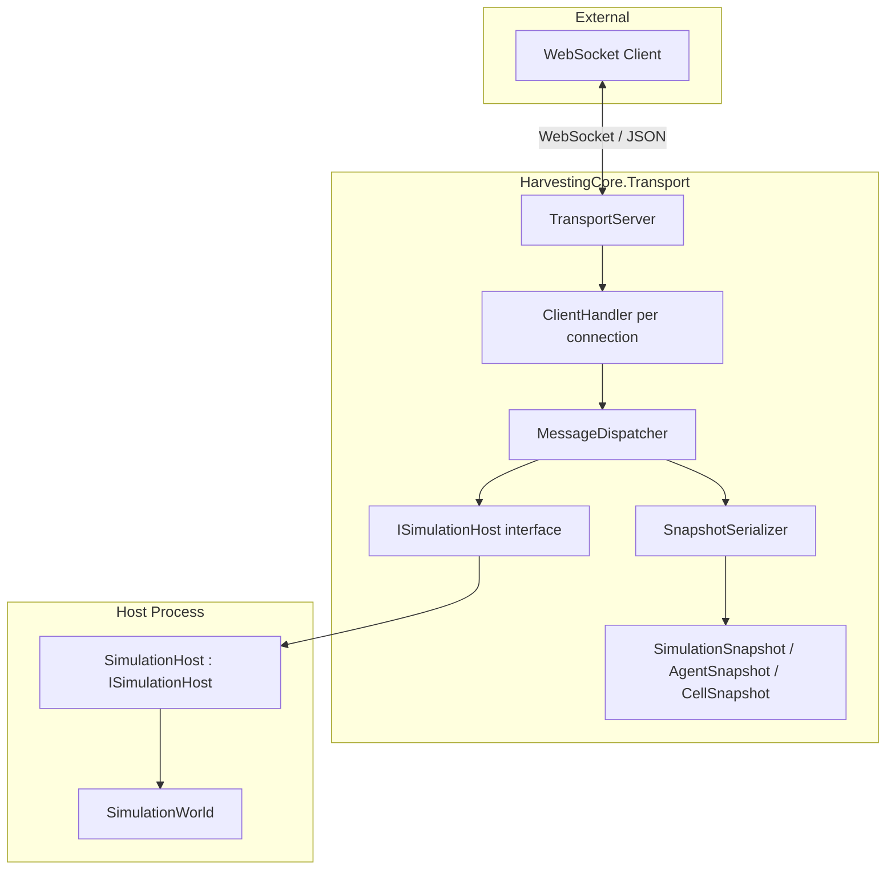

# Design Document: WebSocket Transport Layer

## Overview

The WebSocket transport layer is a standalone project (`HarvestingCore.Transport`) that bridges external clients — dashboards, monitoring tools, test harnesses — to the `SimulationWorld` façade over a persistent WebSocket connection. It does **not** touch the core simulation logic; instead it speaks to the host process through a thin `ISimulationHost` interface, keeping `HarvestingCore` completely free of networking dependencies.

Clients send JSON text frames to request simulation ticks or to read state. The server responds with JSON text frames containing structured snapshots. A well-defined message protocol (`type` discriminator field) makes the client side straightforward to implement in any language.

Key design decisions:
- **Separate project, separate assembly**: `HarvestingCore.Transport` targets `net8.0`; `HarvestingCore` stays on `netstandard2.1`. The transport references the core only for the DTO types and `ISimulationHost`.
- **`ISimulationHost` as the seam**: The transport never holds a reference to `SimulationWorld`, `AgentManager`, or any other core type. This keeps the coupling strictly one-directional.
- **`System.Net.WebSockets` + BCL only**: No third-party networking libraries. An `HttpListener`-backed loop accepts WebSocket upgrade requests.
- **Single tick-execution lock**: A `SemaphoreSlim(1,1)` serialises all `TickAsync` calls, eliminating race conditions between concurrent clients without blocking snapshot reads.

---

## Architecture



The `TransportServer` owns the `HttpListener` loop and spawns one `ClientHandler` task per accepted connection. Each `ClientHandler` reads frames, hands them to `MessageDispatcher`, and writes responses back. `MessageDispatcher` enforces the tick-serialisation lock, calls `ISimulationHost`, uses `SnapshotSerializer` to produce JSON, and returns the bytes to `ClientHandler`.

---

## Components and Interfaces

### `ISimulationHost`

```csharp
namespace HarvestingCore.Transport
{
    public interface ISimulationHost
    {
        bool IsHalted { get; }
        Task TickAsync(CancellationToken ct);
        SimulationSnapshot GetSnapshot();
    }
}
```

The host process implements this. A reference implementation wraps `SimulationWorld`:

```csharp
// Lives in the host process, NOT in HarvestingCore or HarvestingCore.Transport
public sealed class SimulationHost : ISimulationHost
{
    private readonly SimulationWorld _world;

    public SimulationHost(SimulationWorld world) => _world = world;

    public bool IsHalted => _world.IsHalted;

    public Task TickAsync(CancellationToken ct)
    {
        ct.ThrowIfCancellationRequested();
        _world.Tick();
        return Task.CompletedTask;
    }

    public SimulationSnapshot GetSnapshot() => SnapshotProjector.From(_world);
}
```

### `TransportServer`

```csharp
public sealed class TransportServer : IAsyncDisposable
{
    public TransportServer(int port, ISimulationHost host);
    public Task StartAsync(CancellationToken ct = default);
    public Task StopAsync();
    public ValueTask DisposeAsync();
}
```

- Holds a `HttpListener` and a `CancellationTokenSource`.
- Maintains a `ConcurrentDictionary<Guid, ClientHandler>` of active connections.
- On `StartAsync`, validates not-already-running, starts listener, launches accept loop.
- On `StopAsync`, cancels, closes listener, awaits all `ClientHandler` completions, sends close frames (code 1001) to each.
- `DisposeAsync` calls `StopAsync` if not already stopped.

### `ClientHandler`

```csharp
internal sealed class ClientHandler
{
    public ClientHandler(Guid id, WebSocket socket, MessageDispatcher dispatcher);
    public Task RunAsync(CancellationToken serverCt);
}
```

- Reads one frame at a time (chunked into 8 KB segments joined into a `MemoryStream`).
- Passes UTF-8 text payload to `MessageDispatcher.HandleAsync(payload, sendCallback, ct)`.
- Sends the response byte array back through the `WebSocket`.
- On normal or abnormal close, removes itself from the server's active-connection map.

### `MessageDispatcher`

```csharp
internal sealed class MessageDispatcher
{
    private readonly ISimulationHost _host;
    private readonly SemaphoreSlim _tickLock = new SemaphoreSlim(1, 1);

    public MessageDispatcher(ISimulationHost host);
    public Task<byte[]> HandleAsync(ReadOnlyMemory<byte> payload, CancellationToken ct);
}
```

- Deserialises the `type` field via `JsonDocument`.
- Routes to `HandleTickRequest`, `HandleStateRequest`, or produces an `unknown_type` error.
- `HandleTickRequest` acquires `_tickLock` before calling `TickAsync`, releases it after; returns a `TickResponse` per tick, or an error if halted / invalid count / exception.
- `HandleStateRequest` calls `GetSnapshot()` directly (no lock needed for reads).

### `SnapshotSerializer`

```csharp
internal static class SnapshotSerializer
{
    public static byte[] Serialize(object message);
    public static SimulationSnapshot Deserialize(string json);
}
```

Uses `System.Text.Json` (`JsonSerializer` with `JsonSerializerOptions` cached as a static field). Property naming policy: `camelCase`. All DTO types carry `[JsonPropertyName]` attributes to guarantee schema stability regardless of C# naming conventions.

### `SnapshotProjector`

```csharp
internal static class SnapshotProjector
{
    public static SimulationSnapshot From(SimulationWorld world);
}
```

Maps `SimulationWorld` → `SimulationSnapshot`. Lives in the **host project** (or in a shared utilities file), not inside `HarvestingCore.Transport`, to avoid the transport taking a hard dependency on `SimulationWorld`.

---

## Data Models

All DTOs live in `HarvestingCore.Transport` and are `public` so the host and test projects can reference them without reflection tricks.

### `SimulationSnapshot`

```csharp
public sealed class SimulationSnapshot
{
    [JsonPropertyName("tick")]
    public int Tick { get; set; }

    [JsonPropertyName("isHalted")]
    public bool IsHalted { get; set; }

    [JsonPropertyName("dischargedTotal")]
    public int DischargedTotal { get; set; }

    [JsonPropertyName("agents")]
    public List<AgentSnapshot> Agents { get; set; } = new List<AgentSnapshot>();

    [JsonPropertyName("cells")]
    public List<CellSnapshot> Cells { get; set; } = new List<CellSnapshot>();
}
```

### `AgentSnapshot`

```csharp
public sealed class AgentSnapshot
{
    [JsonPropertyName("id")]    public string Id { get; set; }
    [JsonPropertyName("role")]  public string Role { get; set; }   // "Harvester" | "Tractor"
    [JsonPropertyName("state")] public string State { get; set; }  // StateId.ToString()
    [JsonPropertyName("x")]     public int X { get; set; }
    [JsonPropertyName("y")]     public int Y { get; set; }
    [JsonPropertyName("fuel")]  public int Fuel { get; set; }
    [JsonPropertyName("load")]  public int Load { get; set; }
}
```

### `CellSnapshot`

```csharp
public sealed class CellSnapshot
{
    [JsonPropertyName("x")]       public int X { get; set; }
    [JsonPropertyName("y")]       public int Y { get; set; }
    [JsonPropertyName("state")]   public string State { get; set; }   // CellState.ToString()
    [JsonPropertyName("ownerId")] public string OwnerId { get; set; }
}
```

### Inbound message shapes

```csharp
internal sealed class TickRequest  { public string Type { get; set; } public int Count { get; set; } }
internal sealed class StateRequest { public string Type { get; set; } }
```

### Outbound message shapes

```csharp
internal sealed class TickResponse  { public string Type => "tick_response";  public int Tick { get; set; } public SimulationSnapshot Snapshot { get; set; } }
internal sealed class StateResponse { public string Type => "state_response"; public int Tick { get; set; } public SimulationSnapshot Snapshot { get; set; } }
internal sealed class ErrorResponse { public string Type => "error_response"; public string Code { get; set; } public string Message { get; set; } }
```

---

## Project Structure

```
AgenticModel/
  src/
    HarvestingCore/          ← existing, netstandard2.1, unchanged
    HarvestingCore.Transport/
      HarvestingCore.Transport.csproj   ← net8.0, refs HarvestingCore
      ISimulationHost.cs
      TransportServer.cs
      ClientHandler.cs
      MessageDispatcher.cs
      SnapshotSerializer.cs
      Dto/
        SimulationSnapshot.cs
        AgentSnapshot.cs
        CellSnapshot.cs
  tests/
    HarvestingCore.Transport.Tests/
      HarvestingCore.Transport.Tests.csproj
      TransportServerTests.cs
      MessageDispatcherTests.cs
      SnapshotSerializerTests.cs
```

`HarvestingCore.Transport.csproj` constraints:
- `<TargetFramework>net8.0</TargetFramework>`
- `<ProjectReference>` to `HarvestingCore`
- No third-party `PackageReference` items (BCL `System.Net.WebSockets` and `System.Text.Json` are included in `net8.0`).
- `FsCheck.NUnit` or `CsCheck` in the test project for property-based testing.

---

## Correctness Properties

*A property is a characteristic or behavior that should hold true across all valid executions of a system — essentially, a formal statement about what the system should do. Properties serve as the bridge between human-readable specifications and machine-verifiable correctness guarantees.*

