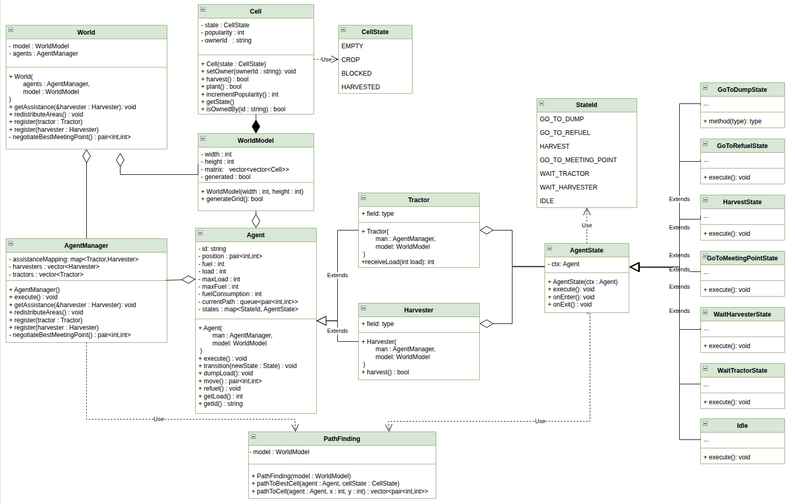
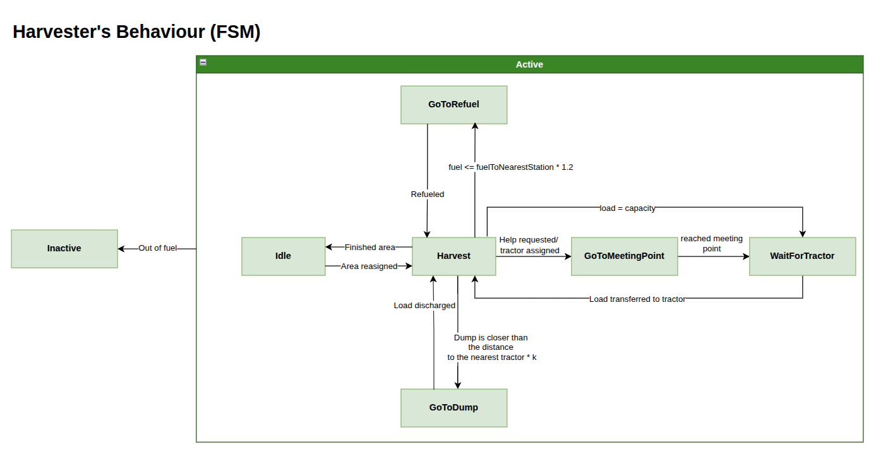
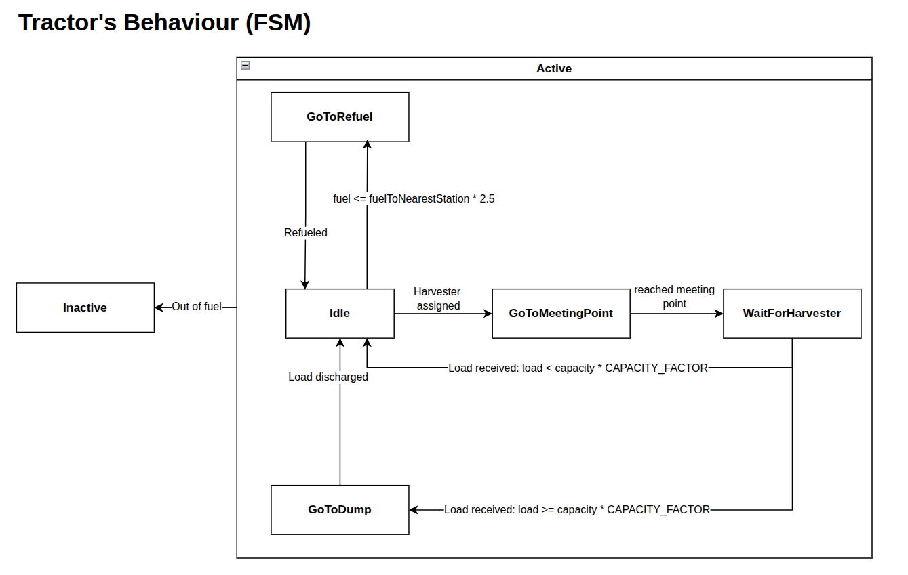

# HarvestingCore

`HarvestingCore` is a deterministic, tick-driven multi-agent simulation core for a crop-harvesting scenario: `Harvester` agents work assigned areas of a grid, `Tractor` agents ferry crop to dump sites and refuel harvesters, and an area distributor keeps work assignments balanced as the field is cleared.

It ships as a plain `netstandard2.1` class library with **zero external dependencies** (no NuGet packages, no `UnityEngine` reference), which makes the compiled DLL safe to drop directly into a Unity project.

## Architecture

```
HarvestingCore.sln
├── src/HarvestingCore/          netstandard2.1 class library (no dependencies)
├── src/HarvestingCore.Transport/ net8.0 WebSocket server + message protocol
└── src/HarvestingCore.Host/     net8.0 console entry point
```



Six layers inside the core assembly, dependencies pointing strictly downward:

- **`HarvestingCore`** - the `SimulationWorld` façade. The only entry point a host (e.g. a Unity `MonoBehaviour`) needs: register agents, call `Tick()`, read state back out.
- **`HarvestingCore.Coordination`** - `AgentManager`, `AreaDistributor`, `PendingMutations`.
- **`HarvestingCore.Agents`** / **`HarvestingCore.Agents.States`** - `Harvester`, `Tractor`, and their finite-state machines.
- **`HarvestingCore.Pathfinding`** - `PathFinder` (Dijkstra / A*), `DeterministicMinHeap`, `Heuristics`.
- **`HarvestingCore.World`** - `WorldModel`, `Cell`, `GridPosition`.
- **`HarvestingCore.Configuration`** - `SimulationConfig`, `DeterministicRandom`.

### Agent state machines

| Harvester | Tractor |
| --- | --- |
|  |  |

### Reference algorithms

The core pathfinding and area-assignment logic is translated from the reference C++ implementations in [`reference/algorithms`](reference/algorithms):

| Reference | C# component | Algorithm |
| --- | --- | --- |
| [`area_distribution.cpp`](reference/algorithms/area_distribution.cpp) | `AreaDistributor` | Multi-source BFS, stamps owner ids |
| [`path_to_best.cpp`](reference/algorithms/path_to_best.cpp) | `PathFinder.PathToBestCell` | Dijkstra to the nearest cell matching a target state |
| [`path_to_cell.cpp`](reference/algorithms/path_to_cell.cpp) | `PathFinder.PathToCell` | A* to a specific cell, pluggable heuristic |

## Running the WebSocket server

### Prerequisites

- [.NET 8 SDK](https://dotnet.microsoft.com/download/dotnet/8.0)

### Build

```bash
dotnet build HarvestingCore.sln
```

### Start the server

```bash
dotnet run --project src/HarvestingCore.Host
```

The server starts on `ws://localhost:8765/` by default.

#### Optional arguments

```
dotnet run --project src/HarvestingCore.Host -- [port] [seed]
```

| Argument | Default | Description |
|---|---|---|
| `port` | `8765` | TCP port the WebSocket server listens on |
| `seed` | `20240101` | Deterministic RNG seed for grid generation |

Example — port 9000, seed 42:

```bash
dotnet run --project src/HarvestingCore.Host -- 9000 42
```

Press **Ctrl+C** to shut down gracefully.

### WebSocket protocol

Connect to `ws://localhost:<port>/` with any WebSocket client.

**Client → Server**

Request ticks:
```json
{ "type": "tick_request", "count": 1 }
```

Request current state without ticking:
```json
{ "type": "state_request" }
```

**Server → Client**

After each tick:
```json
{ "type": "tick_response", "tick": 3, "snapshot": { ... } }
```

Reply to `state_request`:
```json
{ "type": "state_response", "tick": 3, "snapshot": { ... } }
```

Error:
```json
{ "type": "error_response", "code": "...", "message": "..." }
```

**Snapshot shape**

```json
{
  "tick": 3,
  "isHalted": false,
  "dischargedTotal": 12,
  "agents": [
    { "id": "H1", "role": "Harvester", "state": "Harvest", "x": 2, "y": 3, "fuel": 980, "load": 5 }
  ],
  "cells": [
    { "x": 0, "y": 0, "state": "Empty", "ownerId": "H1" }
  ]
}
```

## Using this library inside a Unity project

`HarvestingCore` targets `netstandard2.1`, the highest .NET Standard version Unity's scripting runtime consumes natively (Unity 2021.2+ with the .NET Standard 2.1 API compatibility level, which is the default for modern Unity versions). No Unity APIs are referenced anywhere in the library, so it can be imported in either of the two ways below.

### Option A: import the built DLL (fastest)

1. Build the library in Release mode:

```bash
dotnet build src/HarvestingCore/HarvestingCore.csproj -c Release
```

This produces `src/HarvestingCore/bin/Release/netstandard2.1/HarvestingCore.dll`.

2. In your Unity project, create a folder for third-party plugins, e.g. `Assets/Plugins/HarvestingCore/`.
3. Copy `HarvestingCore.dll` (and `HarvestingCore.pdb` if you want debug symbols) into that folder.
4. Switch back to Unity and let it re-import. The classes under the `HarvestingCore`, `HarvestingCore.Agents`, `HarvestingCore.Coordination`, `HarvestingCore.Pathfinding`, `HarvestingCore.World`, and `HarvestingCore.Configuration` namespaces are now available in any script.

### Option B: import the source (best for stepping through / debugging)

1. Copy the contents of `src/HarvestingCore/` (everything except `bin/` and `obj/`) into a folder inside your Unity project's `Assets/`, e.g. `Assets/HarvestingCore/`.
2. Delete or ignore `HarvestingCore.csproj` — Unity compiles the `.cs` files directly via its own generated project files, it doesn't need the standalone csproj.
3. Unity's compiler already targets .NET Standard 2.1 by default, so no project settings need to change.

### Verifying the import

Once imported (either option), a minimal Unity script that drives the simulation looks like this:

```csharp
using UnityEngine;
using HarvestingCore;
using HarvestingCore.Agents;
using HarvestingCore.Configuration;
using HarvestingCore.World;

public class HarvestingSimulationDriver : MonoBehaviour
{
    private SimulationWorld _world;

    void Start()
    {
        var config = SimulationConfig.Default;
        var random = new DeterministicRandom(config.Seed);
        var model  = new WorldModel(
            width: 32, height: 32,
            refuelStations: new[] { new GridPosition(0, 0) },
            dumpSites:      new[] { new GridPosition(31, 31) });

        _world = new SimulationWorld(model, config, random);
        _world.GenerateGrid();
        _world.Register(new Harvester("H1", new GridPosition(1, 1), model, config));
        _world.Register(new Tractor  ("T1", new GridPosition(2, 1), model, config));
        _world.RedistributeAreas();
    }

    void FixedUpdate()
    {
        if (!_world.IsHalted)
            _world.Tick();
    }
}
```

Attach the script to any `GameObject` and enter play mode. If it compiles and ticks without errors, the import worked. From there, read `_world.Cells` and `_world.Agents` each frame to drive your own rendering/view layer — the library itself never touches `UnityEngine`.

## Building and testing standalone

```bash
dotnet build HarvestingCore.sln
dotnet test HarvestingCore.sln
```
